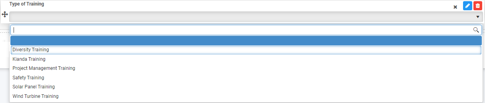

# List fields

**Lists** can be manually entered into a form or linked from an external site like SharePoint, for example a list of Types of Training. There are different display options from dropdown lists to checklists and the ability to make lists mandatory for users to choose in a form amongst other options.

## How to get started

1. To add the List field to your form click on **Controls** > **Input** > **List**. The text box can also be placed within an element for example a panel, by clicking on the panel itself and then add the list. Compare in the image below, the list Type of Training which is inside a panel versus Reason for the request which is outside the panel, both in the form Employee Request.

   

   

2. The New field - List box appears, allowing you different editing options. The options are: 

   - **Title** - the Title of the field, for example Type of Training, a list of different types of training in an organisation

   - **Name** - this is a unique name for the field

   - **Help text** - information to help the form user

   - **List source** - options are a) Entered manually b) Form data c) Data source, for example

     If you choose a) Entered manually, you must type in your list. 

     

     If you choose b) Form data ?[TO COME BACK TO]? then you must choose a **Display field**, the field used to display values and **Value field** [TO COME BACK TO]?

     If you choose c) Data source then click on the **Datasource** button  to connect to different data sources for example SharePoint. For information on how to connect to a data source please see [Data connectors](connectors/ReadME.md). 

     When you select a data source, select the **Display field**, **Value field** and field to Sort by. You can sort values in **Ascending** or **Descending** order. 

      

     Other options include: 

     - **Enable offline cache** - Yes or No

     - **List items limit** (default is 50)

   - **Display format** - options are a) Dropdown list b) Radio list c) Multi select d) Checkbox list

     If you choose a) Dropdown list then you have the additional options:

     - **Filter mode** - the choice is a) Starts with and b) Contains

     - **Enable native selector on mobile** - options are a) Yes or b) No

       

     If you choose b) Radio list or d) Checkbox list then you have an option:

     - **List display position** - the choice is a) Horizontal and b) Vertical

3. Click on the **OK** button  when you are finished editing to save your changes or click on **Close** to exit the dialog box without saving.

4. To move the list, click on the **Drag handle** on the list field itself and drag it to where you want it to appear on the form, for example within a panel. 

5. To change list properties, click on the field itself and the properties pane appears on the right.

   

   Go to [Properties](field/properties.md) to find out more about options.

5. To save your changes to the form, click on the **Save** button .

   When your list is complete you should see the list displaying in the format chosen, for example a dropdown list as shown below.

   

7. To delete the list, click on the field itself and then click on the **Bin/Trash** button  and then click on **Ok** after you have reviewed the field name and are sure this is what you want to delete. Click on **Cancel** if you wish to cancel the deletion.

   

## How to edit List properties

To change the list properties, click on the field itself and the properties pane appears on the right.

The **Field type**, List, is shown along with the **Title **of the field,** in the example above Type of Training.

The options within properties are as follow, check the checkbox to implement:

- **Show Title** - show the title of the field
- **Required** - make this field mandatory for users to fill out
- **Enabled** - the field is enabled for users to fill out
- **Visible** - the field is visible to users
- **Max length** - the maximum number of characters for the field
- **Layout** - change the width of the field by clicking on the bar in the Layout box until you see the desired size. Click on the arrow beside Layout to see the Mobile Layout and click on the bar to change the width of the text box for mobile use.

- **Rules** - rules for input fields are covered in [Rules](rules/README.md).