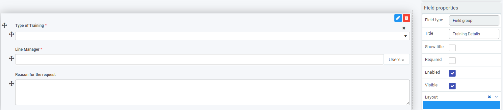

# Field group

Using **field group** is a convenient way to mirror a group of fields that are already created in a form, and reference those fields in your new form.

 

## How to get started

1. To use field group, click on **Controls** > **Layout** > **Field group**.

2. Choose from the edit options:

   - **Title** - of the field group

   - **Name** - this is a unique name for the field

   - **Help text** - information to help the form user

   - **Select fields to group or mirror** - choose one or more fields to group or mirror by clicking on the field and then expanding the list of forms and fields within that process. Click on as many fields as you need to group.

      

   Note that selected fields grouped under the current field group are not copied only referenced.

3. What is Grouped fields? TO COME BACK TO.

4. Click on the **OK** button  when you are finished editing the field to save your changes or click on **Close** to exit the dialog box without saving.

   Noted that the saved group is now available to move and edit as a group within the form.

   

4. To move the group, click on the **Drag handle**   and drag the group to where you want it to appear on the form.

5. To save your changes, click on the **Save** button .

7. To delete the group, click on the group itself and then click on the **Bin/Trash** button  and then click on **Ok** after you have reviewed the field name and are sure this is what you want to delete. Click on **Cancel** if you wish to cancel the deletion.

   

   

## How to edit group properties

To change the group properties, click on the group itself and the properties pane appears on the right.

The **Field type**, Field group, is shown along with the **Title** of the field, in the example above Training Details.

The options within properties are as follows, check the checkbox to implement:

- **Show Title** - show the title of the panel
- **Required** - make this field mandatory for users to fill out
- **Enabled** - the field is enabled for users to fill out
- **Visible** - the field is visible to users
- **Layout** - change the width of the field by clicking on the Layout box until you see the desired size. Click on the arrow beside Layout to see the Mobile Layout and click on box to change the width of the panel for mobile use.

- **Rules** - rules for fields are covered in [Rules](rules/README.md). 