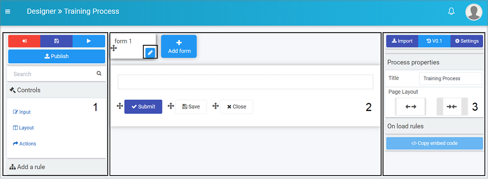
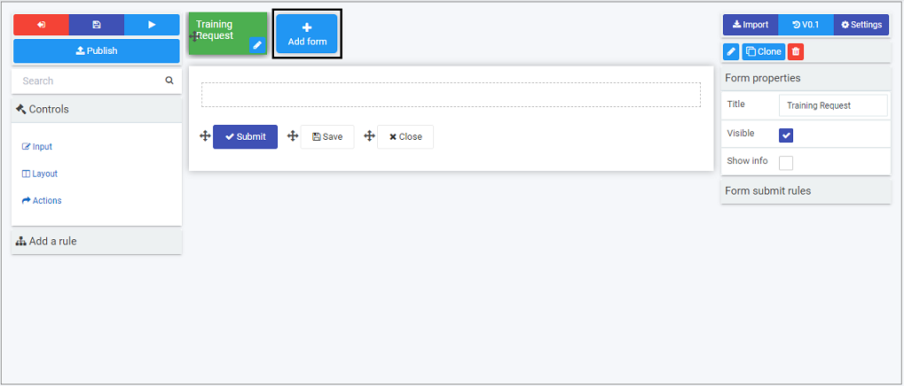

# Create a form #

Once you have created a process, you are in the design page.

There are 3 key areas:

1) Left-hand area is used to add form elements like **controls** and **rules**.
2) Central **form canvas** displays the current form you are working on.
3) Right-hand area is used to view and edit process, form and field **properties**.

1. By default a first form, "form1", is added to your process. Click on the **Pen** button   to start editing this form. 
2. Fill out the details in the **Edit form** dialog box - that is **Title**, **Name**, and **Default owner(s)**, people who will be able to administrate this form, choose from **Users** or **Groups**. There are other options like **Form theme** which are colours that you can apply to the form tab. These options are explained in further details in [Designer](platform/form_designer2.md). Click on **OK** button  when complete.

3. The changes made are visible in the form canvas. Click on the **Add form** button to add a second form.

4. Once you have added one or more forms to your process, you are ready to [Add form elements](formelements.md) to your forms!
