# Add form elements #

Form elements are made up of **Controls** and **Rules** and are available from the left-hand pane when you click into a process.

There are 3 categories of Controls, and 10 categories of Rules, see [Controls](/fields/readme.md) and see [Rules](/rules/readme2.md) for a full listing of what is available. 

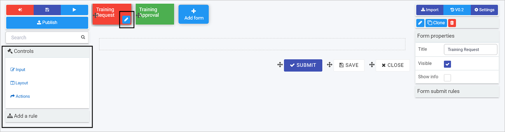

**Note:** By default there are 3 buttons automatically added to forms - Submit, Save and Close. To edit a button or other field, click on the item and then the **Pen** icon. To remove a button or other field, click on the item and then click on the **Bin/Trash** icon. Click on **OK** to confirm removal. To move a button, or other field, click on the **Drag handle** button.

To start adding controls and rules, you need to reference your [process plan](processplan.md) and consider what fields and rules you need. 

When building your design, consider:

> 1. Design - what [properties](#editing-field-properties) can be applied to impact how fields work
> 2. Interaction - what kind of actions can be applied to fields, that is [rules](#applying-rules)
> 3. Management - can I use data from external [datasources](#using-datasources)

Let's use the example of our Training Request form in our Training Process [summary of requirements](processplan.md#summary-of-requirements) which will have 6 control fields to add: 2 text boxes, 1 user picker field, 2 buttons, 1 list field, and one rule to send an email. We will start with adding a textbox field below.

## Adding your first textbox field ##

The first field we are going to add is a textbox field to accept user input. 

1. Click on a form that you want to edit, for example Training Request is selected above, as the **Pen** button   is visible.

2. Click on **Controls** in the left-hand pane. Click on a particular category, for example **Input** and then click on a particular field type to add, for example **Text box**.

3. The field is added to the form. To edit the field, click on the field so the **Pen** button   is visible.

   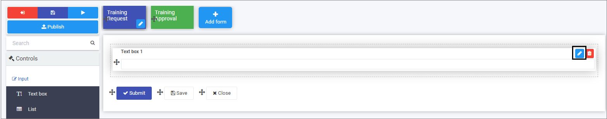

4. Fill out the details in the **Edit field** dialog box - that is **Title**, **Name**, and choose options further options like **Mode** to have users input a **single line of text**, **multiple lines of text** or **rich text**. 

   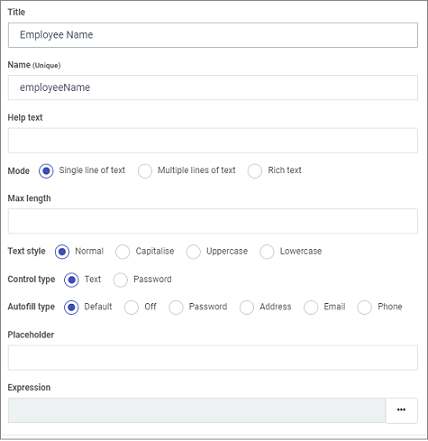

   There are other options like **Text style** where you can choose to Capitalise or have lowercase text only. Go to [Text box](fields/input/textbox.md) for more details. Click on **OK** button  when complete.

5. Repeat the steps above to add another textbox, or other field. For example to add a User Picker field, click on **Controls** > **Input** > **User picker**. Choose from the options in the **New field - User picker** dialog box.  Click on **OK** button  when complete.

   

   The user picker field will be used in this example, to allow the form user to pick from a list of users. This could be a pre-defined group, or individual users. The user picker field could also be connected to an external datasource like a list of line managers from SalesForce.

Now let's consider the other requirements when adding fields, beginning with design and editing field properties.

## Editing field properties

In addition to editing options when you add a field, as shown in **Edit field** dialog box above, you can also change field properties to impact form design.

To edit field properties:

1. Click on a field so the **Pen** button   is visible. Field properties are available in the right-hand pane.

   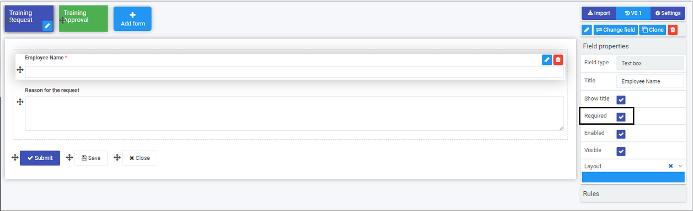

2. Tick checkboxes as appropriate, for example ticking **Enabled** which means users can use the field. **Layout** is used to set the width of the field for both desktop and mobile layouts. In the example above, **Required** is checked which means that the particular textbox field 'Employee Name' is mandatory for users to fill out. Go to [Properties](fields/properties.md) to find out more about properties.

   Being aware of these options will help you to customise your form and impact the way it works.

   

## Applying rules ##

Rules allow actions to happen based upon conditions that result from user interaction with fields. This creates smart, dynamic forms that follow business logic, all without the need for coding. 

In our example we will add a rule to send an automated email to a line manager to approve a request based on a user completing the Training Request form and clicking on Submit. 

1. Click on the **Submit** button to edit the button.

2. Click on **Rules** in the right-hand pane. By default there are 3 rules already applied to the Submit button, to submit, save and close the process when the Submit button is clicked.

   

3. To create an automated email rule, click on **Add a rule** > **Communications** > **Send email** in the right-hand pane.

4. In the **Edit rule - Send email** dialog box, fill out the **Title**, and decide who are the email users, that is who the email will be **From**, **To**, any **CC** or **BCC** that should be included.

   

   There are various options to choose from when selecting email users. When you click on the **User** button choose a selection mode to choose a user, for example **User(s) defined in a user field** will allow you to use a field from a form. When you click in the field below **Select a user field** drill down to the field you want, in this case Line Manager. This means when the user submits a form and chooses their Line Manager, an automated email will go to that Line Manager.

5. Fill out the **Subject** and **Body** text. You can use the **Expression builder** 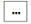to add expressions to the body to personalise the email. 

   

   - Click on the field **Add field to expression** to drill down to the field you want, in this example Employee Name.

   - Click on **Add to expression**.

   - Click on **OK**.

   - Other expressions can be added that use values or status of processes, for example to create a link to review a process, use the ProcessID() expression. Click on **Expression builder** and **Reference** to get a list of 16 expressions you can use.

     

   Using the ProcessID() expression, text can be entered into the brackets to provide a link in the email as follows:

   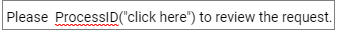

6. Use font and styling options in the body text to set the format of the email. Click on **OK** when complete.

7. The rule is created. Click on the rule in the right-hand pane and drag it to the top of the rule list, to change the **order of execution** so that the automated email is sent out first when a user clicks on 'Submit'.

   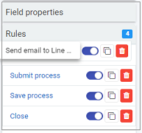

8. For more information on other rules that can be applied, go to [Rules](/rules/readme2.md) for a full listing of what is available.

## Using datasources ##

Kianda comes with a predefined set of data connectors to allow your forms to connect to **datasources** like Oracle, Salesforce, SharePoint and SAP amongst others. 

In this example, we will use a list of Training courses available on SharePoint. 

1. To connect to a datasource, go to the **side menu** > **Administration** > **Data sources**.

1. Click on **+ Add new** button 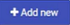 and **SharePoint**.

1. Fill out Site URL and choose from options like SharePoint Online, if its a Site or Site Collection and Authentication mode.

   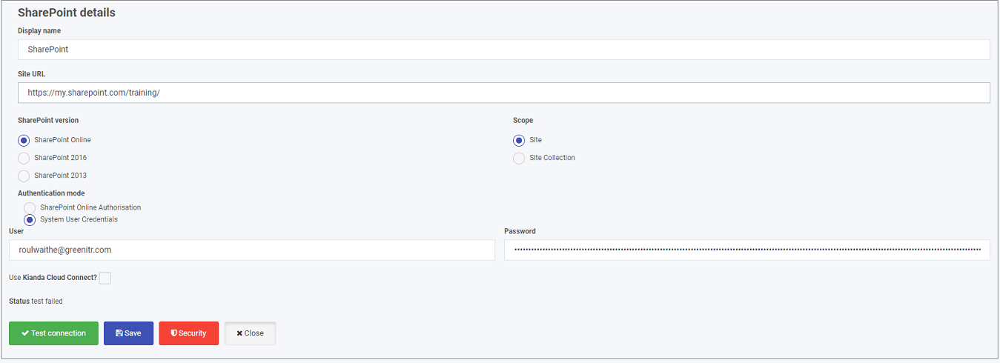

1. Click on **Test connection** and then **Save**.

From here we can add a list field called Type of Training, and choose **Data source** as a List source.

Click on the **Datasource** button and choose the appropriate datasource, in this case a SharePoint list called Training Site. Choose the appropriate **Display field**, **Value field** and choose a field to **Sort by**.

### Final steps ###

Our first form is complete, so we click on the **Save** button to save our work.

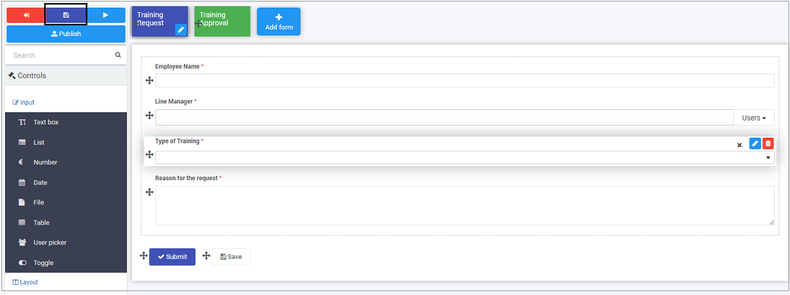

There is a second form that is part of this process, called Training Approval. From the  [summary of requirements](processplan.md#summary-of-requirements) this form will be a simple approval form where we will have 7 fields, and 1 rule, where 2 of the fields are already there by default, namely **Submit** and **Save** buttons. We will add a field group, a banner and a list. Details of these field types are available from [Controls](/fields/readme.md). The rule to add is a **Workflow** rule called **Hide and Disable**, information available from [Rules](/rules/readme2.md).

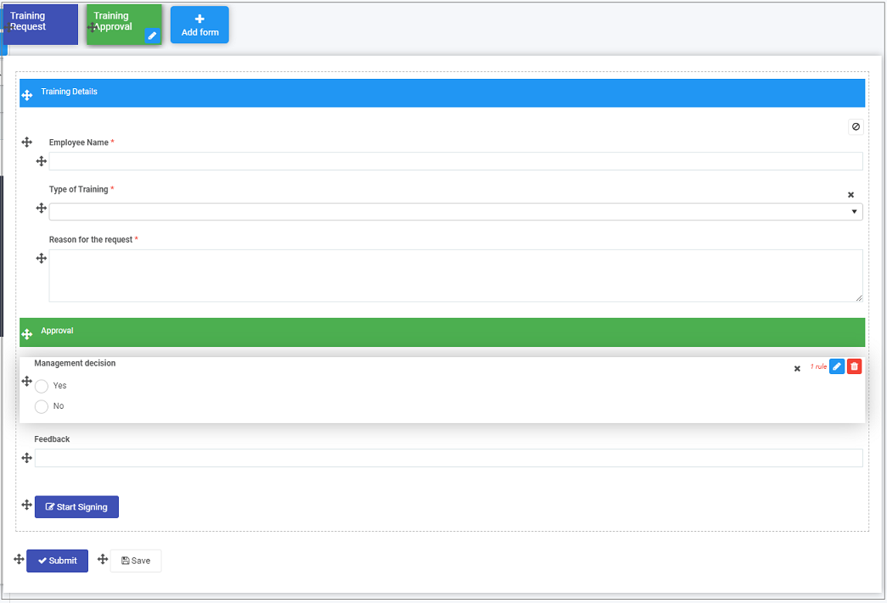 

The end result is a complete process that is ready for testing and publishing. Make sure to click on the **Save** button 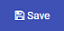to save your work. Go to [Publish your process](processpublish.md) to find out how to perform these steps.

   