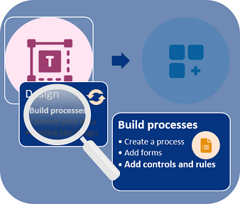
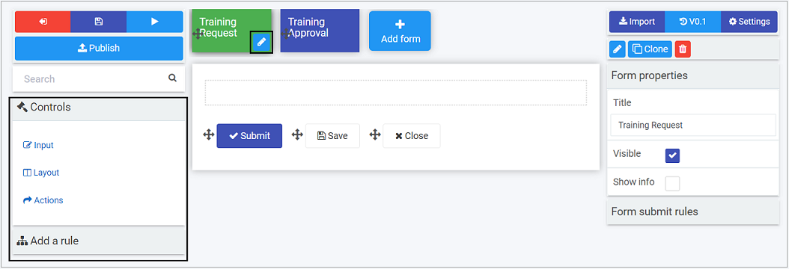
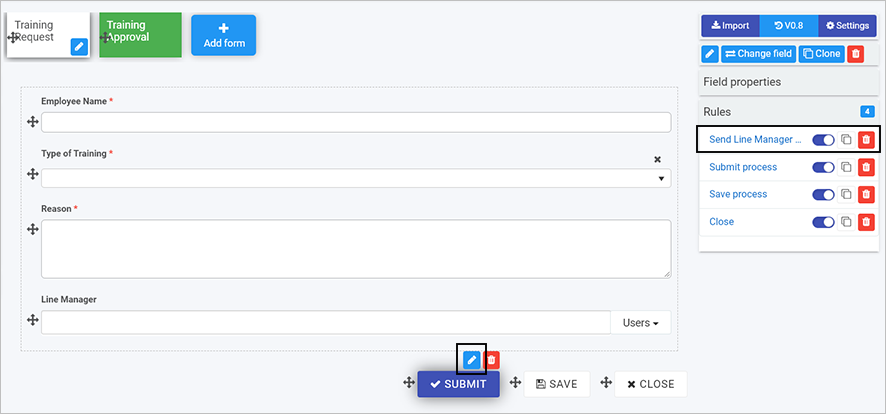

# Add controls and rules #

When you have created forms, then you are ready to add elements to those forms, that is **Controls** and **Rules**. This is the third step in building a process.

***Build process steps***

As you add elements to your form, you can save **drafts**. This allows you make changes and restore to earlier versions if needed, see [Version History](platform/version_history.md) for more information.

## Before you begin  

To add elements to your form, you need to reference your [process plan](getting-started/plan_process.md) and consider **what fields** you need and any **rules** that need to be applied to these fields. We will keep our Training Process [requirements](getting-started/plan_process.md#summary-of-requirements) in mind as we go.

In our example, in the Training Request Form we have 6 control fields to add: 2 text boxes, 1 user picker field, 2 buttons, 1 list field, and one rule to send an email. 

We will start with:

- [adding controls](#adding-controls) or fields to our form

  - editing [field properties](#field-properties)

- then [add rules](#adding-rules)

  

## How to get started

There are 3 categories of Controls, and 10 categories of Rules, see [Controls](/fields/readme.md) and see [Rules](/rules/readme2.md) for a full listing of what is available. 

Controls and rules are available from the left-hand pane in when you click into a process.

***Controls and Rules in left-hand pane***

**Note:** By default there are 3 buttons automatically added to forms - Submit, Save and Close. To edit a button or other field, click on the item and then the **Pen** button. To remove a button or other field, click on the item and then click on the **Bin/Trash** icon. Click on **OK** to confirm removal. To move a button, or other field, click on the **Drag handle** button.

To start adding controls and rules to a form, click on a form of choice so the as the **Pen** button   is visible.

## Adding Controls ##

The first field we are going to add in our example is a textbox field to accept user input. 

1. Click on a form that you want to edit, for example by clicking on the Training Request Form, the **Pen** button   is visible, meaning this form is in edit mode.

2. Click on **Controls** in the left-hand pane. Click on a particular category, for example **Input** and then click on a particular field type to add, for example **Text box**.

3. The field is added to the form. To edit the field, click on the field so the **Pen** button   is visible.

   ***Edit field Pen button***

   

4. Fill out the details in the **Edit field** dialog box - that is **Title**, **Name**, and choose options further options like **Mode** to have users input a **single line of text**, **multiple lines of text** or **rich text**. 

   ***Edit field dialog box***

   

   There are other options like **Text style** where you can choose to Capitalise or have lowercase text only. Go to [Text box](fields/input/textbox.md) for more details. Click on **OK** button  when complete.

5. Repeat the steps above to add another textbox, or other field. For example to add a User Picker field, click on **Controls** > **Input** > **User picker**. Choose from the options in the **New field - User picker** dialog box.  Click on **OK** button  when complete.

   ***New field - User picker dialog box***

   

   The user picker field will be used in this example, to allow the form user to pick from a list of users. This could be a pre-defined group, or individual users. The user picker field could also be connected to an external datasource like a list of line managers from SalesForce. 

6. Edit field properties as necessary to control how fields appear, see [Field properties](#field-properties).  

### Field properties

In addition to editing options when you add a field, you can also change field properties to impact form design.

To edit field properties:

1. Click on a field so the **Pen** button   is visible. Field properties are available in the right-hand pane.

   ***Properties in the right-hand pane***

   

2. Tick checkboxes as appropriate, for example ticking **Enabled** which means users can use the field. **Layout** is used to set the width of the field for both desktop and mobile layouts. In the example above, **Required** is checked which means that the particular textbox field 'Employee Name' is mandatory for users to fill out. Go to [Properties](fields/properties.md) to find out more about properties.

   Being aware of these options will help you to customise your form and impact the way it works.

   

## Adding rules ##

Rules allow actions to happen based upon conditions that result from user interaction with fields. This creates smart, dynamic forms that follow business logic, all without the need for coding. 

In our example we will add a rule to send an automated email to a line manager to approve a request based on a user completing the Training Request form and clicking on Submit. 

1. Click on the **Submit** button to edit the button.

2. Click on **Rules** in the right-hand pane. By default there are 3 rules already applied to the Submit button, to submit, save and close the process when the Submit button is clicked.

   ***Rules for the Submit button***

   

3. To create an automated email rule, click on **Add a rule** > **Communications** > **Send email** in the right-hand pane.

4. In the **Edit rule - Send email** dialog box, fill out the **Title**, and decide who are the email users, that is who the email will be **From**, **To**, any **CC** or **BCC** that should be included.

   ***Selecting a user field***

   

   **Note:** If you leave the **From** field blank, then the email will arrive from "noreply@kianda.com".

   For user fields like **To** and **CC**, there are various options to choose from . When you click on the **User** button choose a selection mode to choose a user, for example **User(s) defined in a user field** will allow you to use a field from a form. When you click in the field below **Select a user field** drill down to the field you want, in this case Line Manager. This means when the user submits a form and chooses their Line Manager, an automated email will go to that Line Manager.

5. Fill out the **Subject** and **Body** text. You can use the **Expression builder** to add expressions to the body to personalise the email. 

   ***Expression builder***

   

   - Click on the field **Add field to expression** to drill down to the field you want, in this example Employee Name.

   - Click on **Add to expression**.

   - Click on **OK**.

   - Other expressions can be added that use values or status of processes, for example to create a link to review a process, use the ProcessLink() expression. Click on **Expression builder** and **Reference** to get a list of 16 expressions you can use.

     ***Expression references***
     
     

   Using the ProcessLink() expression, text can be entered into the brackets to provide a clickable link in the email as follows:

   

6. Use font and styling options in the body text to set the format of the email. Click on **OK** when complete.

7. The rule is created. Click on the rule in the right-hand pane and drag it to the top of the rule list, to change the **order of execution** so that the automated email is sent out first when a user clicks on 'Submit'.

   ***Changing the order of rule execution***

   

8. For more information on other rules that can be applied, go to [Rules](/rules/readme2.md) for a full listing of what is available.

9. Make sure to save your work as you go by clicking on the **Save** button.

10. In the Training Process example, there is a second form that is part of this process, called Training Approval. From the [summary of requirements](processplan.md#summary-of-requirements) this form will be a simple approval form where we will have 7 fields, and 1 rule, where 2 of the fields are already there by default, namely **Submit** and **Save** buttons. We will add a field group, a banner and a list. Details of these field types are available from [Controls](/fields/readme.md). The rule to add is a **Workflow** rule called **Hide and Disable**, information available from [Rules](/rules/readme2.md).

    ***Example of Training Approval form***

     

    

Depending on the fields you use, for example user picker or lists, you can [**connect to a datasource**](getting-started/dataconnect.md) to ensure information used in forms is always up to date. Click on the link to find out how to add a datasource and use it in a form field, for example a list.

### What's next   ###

The next steps are: 

- [**Connect your data**](getting-started/dataconnect.md)
- [**Preview the design**](getting-started/previewer.md)

### **To return to the previous pages click on the links below**   

- [**Design and build your process**](getting-started/design_process.md) 

- [**Add forms**](getting-started/create_form.md)

  

   