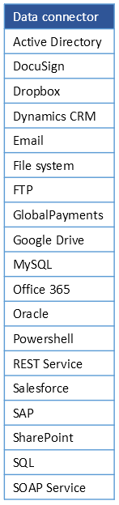

# Connect your data #

Connecting your data to Kianda processes, allows real-time scalability, so as your organisation grows, the processes you have created continue to perform, providing sustainable, flexible growth. Your data may be held in **datasources** like SharePoint, Salesforce or SAP. Kianda comes with 19 predefined **data connectors** allowing you to connect to these datasources, see [data connector list](#data-connector-list) for a full listing.

If you are a developer and want to connect to a datasource that is not included in the predefined set, you can use SOAP or REST to create your own API for data transfer.

Connecting to data happens during the **process design** phase, see image below.

***Design process***

You can set up data connectors first, before building your process if you wish, and then link those data connectors when [adding controls and rules](getting-started/create_process/add_form_elements.md).

The video below highlights how to connect to a datasource, in this example, SharePoint and [How to get started](#how-to-get-started.md) runs through the process in steps including an example of how to use this datasource in a list field.

***Connecting to a datasource using SharePoint***

<video width="100%" style="width:100%" controls>
    <source src="../videos/dataconnectsharepoint.mp4">
    Your browser does not support the video tag.
    </source>
</video>

## How to get started ##

In this example, we will connect to a SharePoint list called 'Types of Training' to use a List field in a form called 'Training Request'. We will then show how to add the list field to a form to use the information from the data connector.

1. To connect to a datasource, go to the **Side menu** > **Administration** > **Data sources**.

1. Click on **+ Add new** button  and **SharePoint**.

1. Fill out **Site URL** and choose from options like **SharePoint version**, **Scope** as in, if its a Site or Site Collection and **Authentication mode**. For example, if you choose **System User Credentials** as an authentication mode, you must provide your SharePoint system username and password.

   ***Connecting to SharePoint***

   

1. Click on **Test connection** and then **Save**.

1. From here we can add a list field called Type of Training, and choose **Data source** as a List source.

6. Click on the **Datasource** button  and choose the appropriate datasource, in this case a SharePoint list called Training Site. Choose the appropriate **Display field**, **Value field** and choose a field to **Sort by**.

	***Edit field dialog box***

	
	
7. The result is a dropdown list called Types of training which is available for use in our Training Request Form. 

   ***Dropdown list from SharePoint***

   

7. When your form is complete, click on the **Save** button   to save your work.

The end result is a complete process that is ready for test and review. Go to [Preview the design](getting-started/create_process/previewer.md) to find out how to perform these steps.

## Data connector list ##

A full list of data connectors is available in the table below.

***Data connector table***

### What's next   ###

The next steps are: 

- [**Preview the design**](getting-started/create_process/previewer.md)
- [**Publish your process**](getting-started/create_process/publish_process.md)

### **To return to the previous pages click on the links below**   

- [**How Kianda works**](getting-started/welcome/how_kianda_works.md)
- [**Design and build your process**](getting-started/create_process/design_process.md) 
- [**Add forms**](getting-started/create_process/create_form.md)
- [**Add controls and rules**](getting-started/create_process/add_form_elements.md)

  