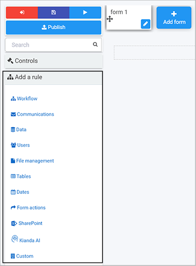
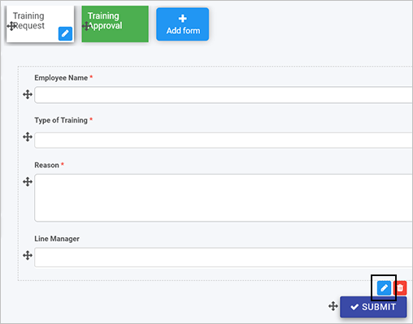

# Rules #

Business rules are what makes Kianda forms come alive. They represent the actual actions users intend to perform when they interact with form components. There are 59 predefined rules you can apply to forms, see [Rules list](#rules-list).

There are two key principles to consider when working with forms:

1. [Rule design](#rule-design) - what type of rule you are going to apply and where, for example to a button, field or form.

2. [Rule order](#rule-order) - if there are several rules attached to an item like a button, then the order of execution is important and can be modified to suit your needs.

   

## How to get started ##

If you go to **Side menu** > **Administration** > **Designer** and click on a process or create a new process, the predefined rules are found in the left-hand pane under **Add a rule**.

***Rule categories***

By default there are 10 categories of rules, see [Rules list](#rules-list) for rule names :

1. **Workflow** - There are 6 workflow rules that represent the actions a user intends to perform, when they interact with form components. 
2. **Communications** - There are 4 communication rules associated with user communication for example sending an email or triggering a user alert. 
3. **Data** - There are 5 data rules associated with database operations like create, update and delete. 
4. **Users** - There are 4 user rules associated with user properties, allowing user lookup or to update a user. 
5. **File management** - There are 7 file management rules concerned with generating documents such as Word, Excel or converting to PDF. 
6. **Tables** - There are 12 table rules associated with table operations such as updating, adding and removing table rows. 
7. **Dates** - There are 4 date rules to calculate time and format dates.
8. **Form actions** - There are 6 form rules linked to actions that are part of forms, for example submit, close or save.
9. **SharePoint** - There are 10 SharePoint associated rules such as adding, finding or removing users. 
10. **KiandaAI** - there is 1 KiandaAI rule related to text analysis.

An additional  **Custom** category exists if Kianda **Developer** has been used to create custom rule widgets  see [Developer](getting-started/welcome/low_code.md#how-to-get-started-with-developer) for more details. 

## When to use rules

You can add rules:

- [x] to a field
- [x] to a form 
- [x] to a process (the rule will run on load)

### Rule design ###

1. Click on an existing process by going to **Administration** > **Designer** and decide which form or field you will apply the rule to, by clicking on that item so that it is in **edit mode** so you can see the Pen button,  **Pen** button  for example a form Training Approval or Submit button.

   ***Field editing***

   

2. Click on **Add a rule** in the right-hand pane and click on a category of choice, such as **Communications** and then a rule **User alert**.

 

### Rule order ###

If there is more than 1 rule for an item like a field or button, then the order of execution must be considered. 

For example for a Submit button on a form you may want a **Send email rule** to be executed first before any other rule is executed. To do this click on the **Submit** button to make sure you are in **Edit** mode, and under **Rules** in the right-hand pane,  drag the **Send email** rule to the top of the list by clicking on the rule and dragging it to the top.

***Rule order***

## Rules list ##

A full list of rules is available in the table below.

***Rules by category and title***

### What's next   ###

To learn more about control fields go to [**Controls**](getting-started/create_process/controls.md). 

### **To return to the previous pages click on the links below**   

- [**How Kianda works**](getting-started/welcome/how_kianda_works.md)
- [**Plan your process**](getting-started/create_process/plan_process.md) 
- [**Design and build your process**](getting-started/create_process/design_process.md) 
- [**Add forms**](getting-started/create_process/create_form.md)
- [**Designer**](getting-started/create_process/designer.md)
- [**Properties**](getting-started/create_process/properties.md)
- **[Add controls and rules](getting-started/create_process/add_form_elements.md)**

  

  