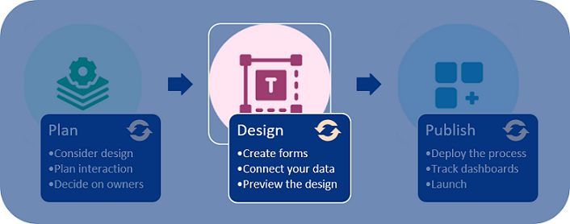
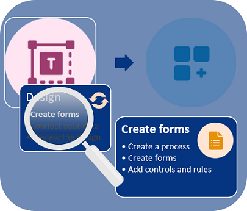
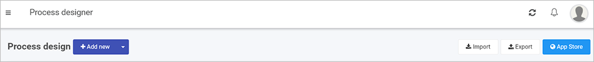

# Design and build your process

Kianda processes are made up of **forms**. As we saw in [Plan your process](processplan.md), you may have a paper forms or email flows that you want to turn into a dynamic, digital process. 

## Designing in Kianda

To turn your process plan into a Kianda design using the agile approach, follow 3 simple steps: [**Create forms**](getting-started/create_form.md), [**Connect your data**](getting-started/dataconnect.md), [**Preview the design**](getting-started/preview_design.md).

***Design process***

The form creation process itself involves: creating the **process** for the forms, creating the **forms** themselves and then adding **controls and rules** to the form. Once you have previewed the design you may wish to go back and make changes to the form.

***Creating forms: 3 steps***

We will deal with each phase in turn starting with [creating a process](#create-a-process). 

## Before you begin  

To start creating a process and forms, you need to reference your [process plan](getting-started/plan_process.md) and consider **what forms** you need and **who** will have access to these forms as an administrator. We will keep our Training Process [requirements](getting-started/plan_process.md#summary-of-requirements) in mind as we go.

The very first thing to do to create forms is to **create a process** for the forms. 

## Create a process ##

1. To create a process, go to the **Side menu** and click on **Administration** > **Designer**.

2. You are now in the main process view. From here you can click on **Import** or **Export** to import or export processes when created. There is also an option to use Kianda's predefined processes available in the **App Store.** 

   Click on the **Add new** button to create a process from scratch.

   ***Adding a new process***

   

3. Fill out the details in the **Add new process** dialog box - that is **Title**, **ID** (a unique Name that autofills from the title), **Description**, **Group** (if you have a predefined group) and **Administrators**, people who will be able to administrate this process, choose from **Users** or **Groups**. Click on **OK**  when complete.

   ***Add new process dialog box***

   

4. You are now in the process design page. From here you can [Create a form](formcreate.md).

   ***Process design page***

   

   
   
   

### What's next   ###

The next steps are: 

- [**Create a form**](getting-started/create_form.md)
- **[Add controls and rules](getting-started/add_form_elements.md)**

### **To return to the previous pages click on the links below**   

- **[Create your process](getting-started/create_process.md)**
- **[Plan your process](getting-started/plan_process.md)**

