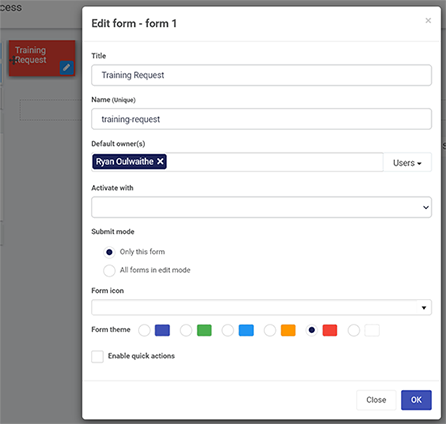
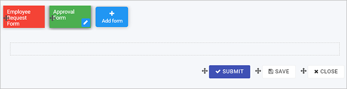

# Designer # 

Kianda **Designer** provides an intuitive interface where you can quickly start building **forms** for any business use case. Forms are an important component of any process. They might be used as a stage of a process and can be made active individually or at the same time (parallel forms).

There are 3 key principles to consider when working with forms:

1) Form **design** - what a form looks like, what elements it contains, for example controls and rules, see [**Designer layout**](#designer-layout)
2) Form **interaction**- how users can use forms depending on certain sequences happening, see [**Rules**](getting-started/rules.md) 
3) Form **management** - who can edit and access forms is set when creating a new form, see [**New forms**](#new-forms)

## Designer layout ##

To access processes, go to the left-hand pane and **Administration** > **Designer** and click on a process that you have created or imported, see [Design and build your process](getting-started/design_process.md).

From the main process view, click on any process to add forms, for example Training process as seen below.

***Main process view***

The designer window opens and is made up of 3 main parts.

***Kianda Designer***

The key components of the designer are:

1. Left-hand pane is used to add form elements like **controls** and **rules**. This pane also houses the **Exit** Designer  **Save**   **Preview**  and **Publish**  buttons.
2. Central **form canvas** displays the current form you are working on.
3. Right-hand pane is used to view and edit process, form and field **properties**.

Note the name of the process you are working on is shown in the top menu bar, for example Training Process.

The video below demonstrates how to get started using Kianda Designer, and go to [How to get started](#how-to-get-started) to follow through on different ways to import forms or start from scratch. 

***Introduction to Kianda Designer***

<video width="100%" style="width:100%" controls>
    <source src="../videos/designerintro.mp4">
    Your browser does not support the video tag.
    </source>
</video>

## How to get started

1. How you get started with forms depends on:

   - if you have created a process using the App Store, see [Predefined forms](#predefined-forms)

   - if you have created a process from scratch or want to create a form from scratch, see [New forms](#new-forms)

   - if you import forms that have already been created, see [Import forms](#import-forms)

2. Once your form is created, you are ready to start adding elements to your form, see [Add controls and rules](getting-started/add_form_elements.md). 

3. In addition there are a number of settings you can change, see [Settings and Properties](#settings-and-properties). 

   

### Predefined forms ###

1. If you have created a process using the **App Store,** then a number of forms will already be part of the process. For example the process Security Incident Management has 5 forms attached: Incident detail, Data breach, Malware outbreak, Root cause remedy and Caller review. 

2. To edit form details, simply click on a form and click on the **Pen** button  to edit the form. You can also click on the **Add form** button to add a new form. Edit options are shown under [New forms](#new-forms).

   

### New forms ###

1. If you have created a process from scratch, an empty form is added to your process by default, called "form 1". This is the first form. Click on this form and the **Pen** button  to customise it. You can also click on the **Add form** button to add a new form. 

   ***Adding a form***

   

2. There are a number of edit options below.

   ***Editing a form***

   

   Note: as you change any of the options in the dialog box, the impact will be shown in real-time on the form in the background, for example a title, or colour form theme.

   1. **Title** - the form title, for example Employee Request Form

   2. **Name** - this is a unique name for the form

   3. **Default owner(s)** - by default the form creator is an owner. You can remove this owner by clicking on  and add other owners by clicking on the arrow and choose from **Users**, **Groups** or **Partners**. 

      - Users - allows you to choose individual owners
      - Groups - allows you to choose from defined groups for example HR Team or Management Team
      - Partners - allows you to choose predefined partner organisations that you want to share with or provide permissions

   4. **Activate with** - will decide when the form will be active. If you have several forms attached to a process, then select from a dropdown list the form you want to activate with the current form. If you leave the field blank, the new form will be activated **sequentially** after the first form is submitted. 

   5. **Submit mode** - options are a) Only this form (the current form) or b) All forms in edit mode

   6. **Form icon** - click on the arrow to choose from hundreds of icons to attach to your form.

   7. **Form theme** - choose from Navy, Green, Blue, Amber, Red or White Colours for your form.

   8. **Enable quick actions** - if you tick the checkbox, you can select from the options a) Enable re-assign b) Enable edit and c) Enable custom action. Click on **Ellipsis** button  to further modify the action settings. 

      - If you click on **Enable re-assign**, you can reassign action settings to particular Users, Groups or Partners. Click on **Allow form owners** if you want form owners to be able to reassign actions.

      - If you click on **Enable edit**, you can allow certain Users, Groups or Partners to edit the form, along with form owners by clicking on **Allow form owners**. 

        Other options include a checkbox for **When editing auto hide form footer buttons** and **Trigger rules on save**.

        - If you check **Trigger rules on save** then click into the **Save action field** to choose from an action trigger as to when the form is saved, for example Submit, Save or Close. These can be other actions depending on what you have defined.

          ***Edit action settings***

        

      - If you click on **Enable custom action**, you can allow certain Users, Groups or Partners to edit the form, along with form owners by clicking on **Allow form owners**. 

        Other options include **Action label**, **Target action field** and **Action display mode**, for example **Read-only mode**, **Edit mode** or **Both**.  
      
        ***Custom action settings***
        
        

   As a form designer you can set up actions dependent on certain conditions, for example an Action label that targets a certain button appearing for example Close button, only when a certain display mode is chosen, for example Read-only mode. If **Edit mode** is chosen, then the button will only appear when the form is being **edited**. In this way you can create dynamic forms that suit user interactions.

3. Click on the **OK** button when you are finished editing to save your changes or click on **Close** to exit the dialog box without saving.

4. To save your changes to the form, click on the **Save** button . 

5. You are now ready to start adding [Controls and rules](getting-started/add_form_elements.md) to your form. You can also implement additional settings see [Process Settings](#process-settings).

   

### Import forms ###

1. You can import a previously designed form by clicking on the **Import** button .

2. Click on the arrow to select from the drop down list to **Select a process design**. 

3. Click on a **process** of interest and then click on the forms to import. Forms are indicated by a + symbol and can be expanded to show elements within a form for example a panel containing different fields such as lists and text boxes. This means you can import a whole form, or just elements of a form. In this way you can very quickly reuse some or all parts of an existing form. 

   ***Importing from another process***

   

4. Click on the **OK** button when you are finished editing to save your changes or click on **Close** to exit the dialog box without saving.

## Adding form elements ##

If you have added a new form during the form creation process, then a blank canvas with 3 default buttons are available to you: **Submit**, **Save** and **Close**. 

***Default form buttons***

1. Go to [Add controls and rules](getting-started/add_form_elements.md) to find out more about adding form elements. 
1. Move elements by clicking on the **Drag Handle**  beside the item and dragging it to where you want to place it. 
1. Edit elements by clicking on each item and clicking on the **Pen** button  see [Settings and properties](#settings-and-properties)

 ## Settings and Properties ## 

In addition to the edits above, there are a number other actions and settings that you can implement to your process and forms. 

***Settings and properties***

Settings are available from the right-hand pane and give you the ability to:

- [Import processes](#import-forms)

- View [Version history](getting-started/version_history.md)

- Change [Process settings](#process-settings) 

- Edit form information by selecting a form and clicking on the **Pen** button .

- Change a field to another field by clicking on  **Change field**

- Create a duplicate form by selecting a form, clicking on the **Clone** button  and then click on **Ok**. A version called 'Form Name Copy' is created and available to edit on the canvas. The **Clone** button can also be used to clone form elements like controls or buttons. 

- Delete a form by selecting a form, clicking on the **Bin/Trash** button  and then click on **Ok** after you have reviewed the form title and you are sure this is what you want to delete. Click on **Cancel** if you wish to cancel the deletion.

- View and edit [Form properties](getting-started/properties.md) and [rules](getting-started/rules).

  

### Process settings

You can edit process settings by clicking on the **Settings** button  in the right-hand pane. 

Choose from the settings:

1. **Process id settings** - choose from a) Default or b) Custom and use a combination of [ProcessName]-[UniqueNumber]-[FieldName]

2. **Enable process security** - if you tick the checkbox, can allow certain Users, Groups or Partners to have certain privileges related to the radio button options to create, assign and view as shown below.

   ***Enable process security***

   

   The default setting is **Security users can create, assign to can update, everyone else can view**.

3. **On load rules execution mode** - options are a) Always b) When in edit mode or c) When open new. The default setting is **Always**. 

4. **Hide form tabs** - gives you the ability to hide form tabs, options are a) Yes or b) No 

5. **Hide left nav** - gives you the ability to hide navigation elements, options are a) Yes or b) No 

6. **Enable anonymous sharing of forms** - gives you the ability to share forms with people outside your organisation for example a feedback form or GDPR subject access request. Options are a) Yes or b) No. If you click on **Yes** there are various options that you can add:

   - **Message to display after anonymous submission** - to add a display message

     ***Enabling anonymous sharing***

   

   - **Hide form topbar** - checkbox to hide the form topbar.
   - **Force log out** - options are a) Yes or b) No to force user logout once the form is submitted
   - Click on **New link** to generate a new anonymous form link to share with users and click on **Edit** to change the link. 

7. **Enable mobile bottom navigation** - options are a) Yes or b) No 

8. **Instance delete settings** - options are a) Any user can delete b) Creator can delete c) "Current form owner" can delete d) "Security users" can delete e) "Admins only" can delete. The default setting is **Creator can delete**.

9. **Enable form assignment notification** - options are a) Yes or b) No 

10. **Prevent closing instance with unsaved data** - options are a) Yes or b) No

11. **Selected tab theme** - choose from Navy, Green, Blue, Amber, Red or White as a colour when a form is selected.

12. **Completed tab theme** - choose from Navy, Green, Blue, Amber, Red or White as a colour when a form is completed.

13. Click on the **OK** button  when you are finished editing to save your changes or click on **Close** to exit the dialog box without saving.

14. Click on the **Exit** button  to go back to the process list, the Save button  to save your work, the **Preview** button  to preview what you have created and the **Publish** button  to publish your work.

### What's next   ###

- To learn more about rules and controls that can be applied to forms go to [**Controls**](getting-started/controls.md) and [**Rules**](getting-started/rules.md). 
- To learn more about properties, go to [**Field properties**](getting-started/properties.md#field-properties).

### User tips  ###

1. There are many ways to then reuse elements within forms, see the video [**Reusability**](getting-started/how_to.md#how-to-reuse-forms).
2. There are many ways to manage who has access to a process, or form, see the video [**User management**](getting-started/how_to.md#how-to-manage-user-access).

### **To return to the previous pages click on the links below**   

- [**How Kianda works**](getting-started/how_kianda_works.md)
- [**What is low-code development**](getting-started/low_code.md)
- [**What is no-code development**](getting-started/no_code.md)
- [**Design and build your process**](getting-started/design_process.md) 
- [**Add forms**](getting-started/create_form.md)
- **[Add controls and rules](getting-started/add_form_elements.md)**
- [**Properties**](getting-started/properties.md)
