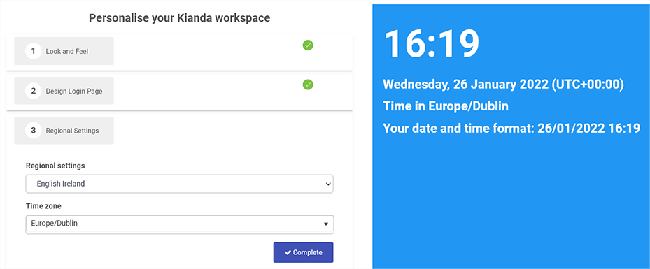

# How different images are captured and viewed 

Temporary file to showcase quality of different images depending on screen capture size, browser used, resizing and format.

Starting point was image approved at meeting on 25/1/22, see Image 1 below.

***Image 1 - Captured in Edge, 125% zoom, not resized, left at 100%. png format, size 36KB, 1538 x 642px***

 

***Image 2 - As image 1, today's version using Edge, 125% zoom, left at 100% (not resized), png format, 34KB size, 1548 x 641px***

***Image 3 - As image 2, resized to 60% and without a frame, 51KB size, 929 x 385px*** 

***Image 4 - As image 2, resized to 80% and with a frame, 71KB size, 1239 x 513px***

***Image 5 - As image 2, saved as .gif, 33KB size, 1548 x 641px***

