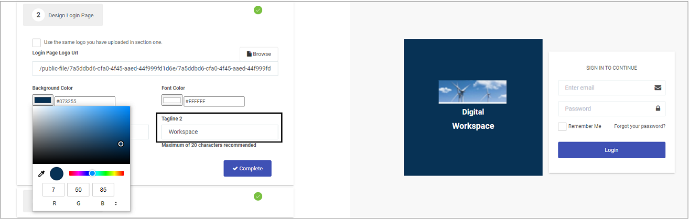
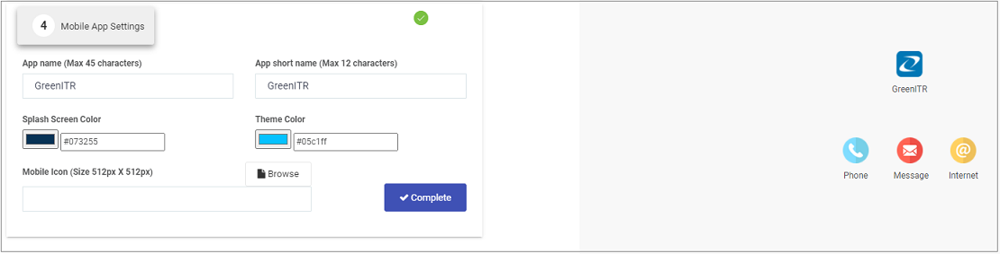

# Personalise your workspace

When you login to Kianda for the first time, a wizard opens to allow you to change the look and feel of your workspace, as well as managing regional and mobile app settings.

## How to get started ##

1. In the **Look and feel** section of the wizard, click on **Browse** to upload your company logos, for both a full logo and collapsed size logo. 

   - Click on a colour scheme under **Themes** and preview the results on the right.

     ***Personalise your workspace look and feel***

     

   - Click on **Complete** when done.

2. In the **Design Login Page** section, customise how the login page will look. 

   - Click on **Browse** to upload a logo or check the checkbox above the Logo URL to use the same one as used in Step 1. 

   - Under **Background** and **Font**, type in your hex value for your chosen colour, or click on the colour box and use the eyedropper or slider to choose your chosen colour, or type in RGB values.

     ***Design your Login page***

     

   - Click into the fields under **Tagline 1** and **Tagline 2** to type in the words or phrases that will appear on your login page, previewed on the right.

   - Click on **Complete** when done.

3. In the Regional settings section, choose your time zone settings.

   - Click on **Regional settings** and choose an appropriate setting from the dropdown list.

   - Click on **Time zone** and choose an appropriate time zone from the dropdown list.

     ***Change Regional Settings***

     

   - Click on **Complete** when done.

4. In the **Mobile App Settings** section, you can customize how the Kianda workspace will appear as a mobile app.

   - Type in a name under **App name** and **App short name**

   - Under **Splash Screen** and **Theme**, type in your hex value for your chosen colour, or click on the colour box and use the eyedropper or slider to choose your chosen colour, or type in RGB values.

     ***Change Mobile App Settings***

     

   - Click on **Browse** to upload an icon for your mobile app.
   
   - Click on on **Complete** when done.

Click on **You are ready to go** to close the wizard. At any time you can change settings again by going to the **side menu > Subscription** and click on a particular area of interest or click on **Open Wizard**.

***Subscription page***

### What's next   ###

Go to **[Create your Kianda process](getting-started/create_process.md)** to start creating your first process.

### **To return to the previous pages click on the links below** 

- **[Welcome to Kianda](getting-started/readme.md)**
- **[Logging in to Kianda](getting-started/logging_in.md)**

