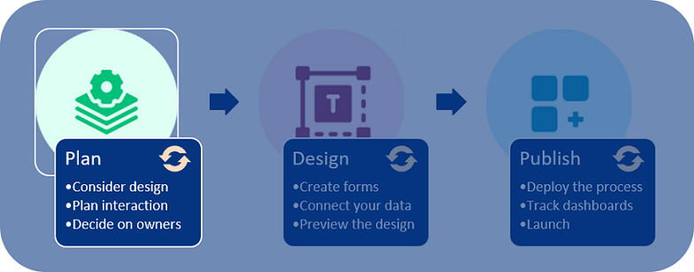

# Plan your process

Currently you may have paper forms or email flows that you want to formalise, digitise and most importantly, link to dashboards to see at a glance how processes are running and where organisational improvements are needed.

For example take the scenario of a Training Request. An employee may email a line manager requesting to attend training. The line manager either approves or disapproves the request by returning an email or calling the employee. If the training request is approved then the training manager is informed that the employee will attend the next training event and schedule this. 

***Training Request flow by email***

Rather than continuing the above, creating an email trail with no easy way to see the overall end-to-end process and status of each step, creating a solution in Kianda will save time, increase efficiencies and therefore reduce costs.

## Planning in an aigle way

Planning involves 3 considerations: [**Design**](#design) , [**Interaction**](#interaction)  and [**Management**](#management) explained below.

***Planning process***

To plan a solution, you could use Microsoft Office Tools or other preferred program or method to chart out what you need. Each heading will guide through what you need to consider.

## Design ##

1. What **forms** do you need? What kind of **fields** will be used to get the data you seek? What about information do you need to provide to form users? Connecting to **datasources** like information in SharePoint, Salesforce or SAP will make your processes dynamic and up to date.

   In the example of a Training Request process, information sought is in blue below, while information provided, for example a SharePoint list, is in black, and everything is listed where it potentially will be displayed, that is forms and a dashboard.

   ***Example of Training and Approval Form fields***

   

2. It might help to know what kind of fields there are in Kianda and to keep this in mind when capturing requirements, see Kianda [Controls](/fields/readme.md).

## Interaction ##

1. Decide on the sequence of events for example what information will be sought at what point, what is the end point in each step. What **rules** can be applied to create a trigger for the next event? 

   In the Training Request process, we've now introduced **Submit** buttons to trigger actions, and a **Rule** so that the form will appear differently based on different inputs.

   ***Example of Training and Approval Form fields and rules***

   

2. It might help to know what kind of rules there are in Kianda and to keep this in mind when capturing requirements, see Kianda [Rules](/rules/readme2.md).

## Management ##

1. Finally you need to consider **who will have access** to the information. When designing forms you can enable elements within a form so that they appear as visible-only or editable. 

   ***Example of Training and Approval Forms with access limits***

   

2. You also need to consider who are the **form owners**, that is who will have editing access to the forms themselves. This information is needed when you create a process and add forms. At this point you will need to decide what users, or groups will act as form and process administrators. 

## Summary of requirements ##

Finally we can summarise all the information we need in a table. Field types or controls and rules will become more familiar as you work with Kianda. For now use this example as a way to get to know what is possible in Kianda.

***Examples of Requirements for a Training Request and Approval Process***

### What's next   ###

Now that you know what to consider and have a design in mind, you can go to [**design your process**](getting-started/design_process.md) to learn how to get started in the Kianda **Designer**.

If you have coding experience and want to delve straight into how you can use Kianda to create your own widgets, go to **[Developer](getting-started/developer.md)** to learn more.

### **To return to the previous pages click on the links below**   

- **[Logging in to Kianda](getting-started/logging_in.md)**
- **[Create your Kianda process](getting-started/create_process.md)**

