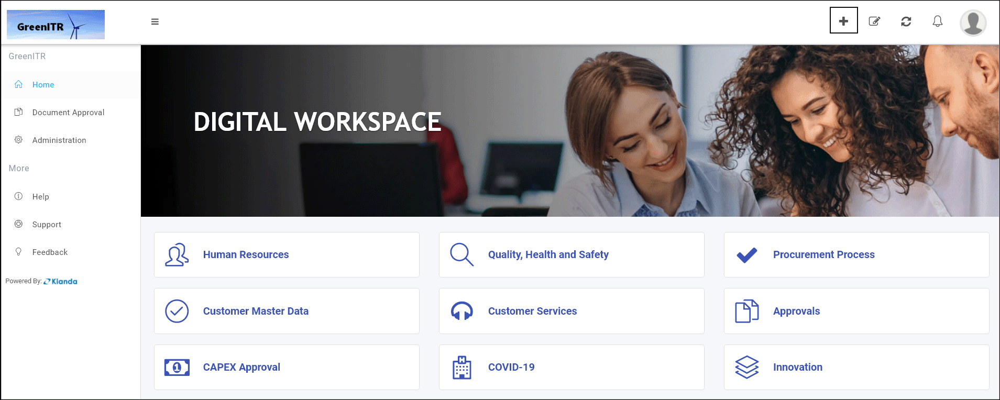
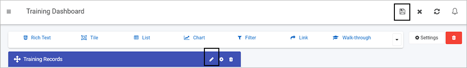
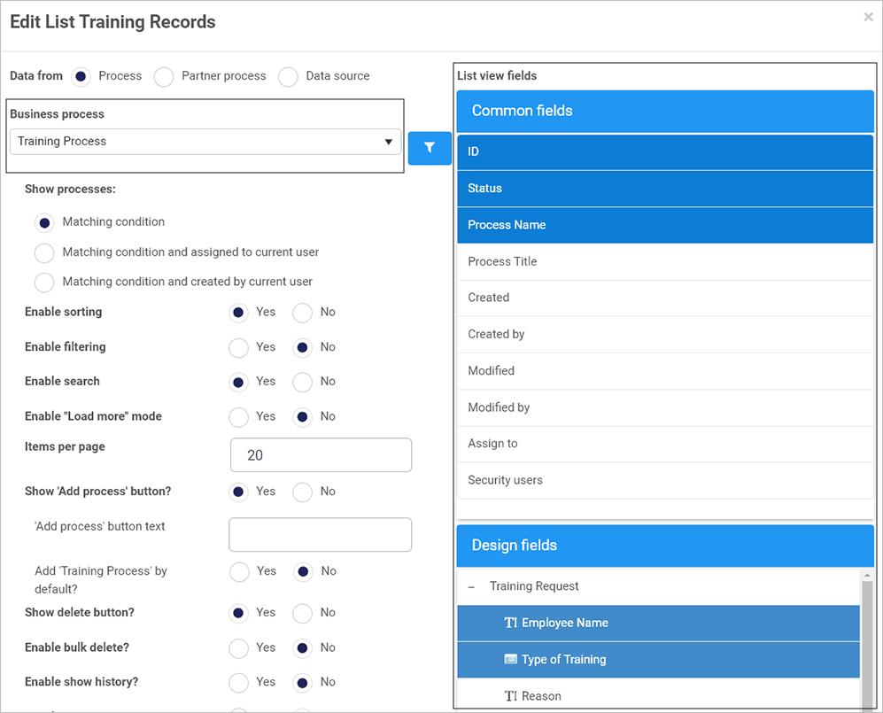
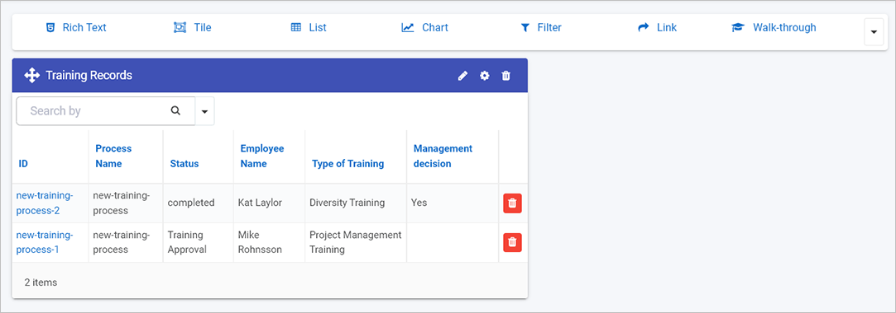
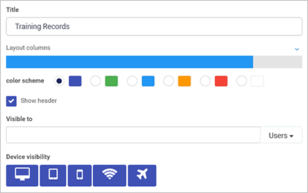

# Publish your process #

When you have designed and built your process(es), you are ready to publish. Publishing involves 3 steps: [**Deploying the process**](#deploy-the-process), [**Tracking dashboards**](#track-dashboards) and [**Launch**](#launch).

***Design process***

## Deploy the process ##

When you have tested your process prototype, by previewing and adding some data and you are happy with the process output in the format of a dashboard, then you are ready to publish your process to selected users. It is prudent to have a limited deployment initially making the process available to stakeholders and testers to review. This limited group should include users with various levels of technical skill. 

1. Before publishing, make sure you save your work. Go to the **Side menu** > **Administration** > **Designer** > click on the **process name**.

2. Click on the **Save** button in the left-hand pane. Note that the **Version** of the process is available in the right-hand pane, where the current version is always visible.

***Saving a process***

4. When you are ready to Publish, click on the **Publish** button.

5. Fill out the **Publish process** dialog box by adding comments. Choose from 'Yes' or 'No' to bulk update process instances. 

   ***Publishing a process***

   

   If you choose 'No' then the latest version is saved and published. If you choose 'Yes' then process instances will be updated with the latest design version. Two further questions are prompted:

   - **Trigger field rules after design update?** Options are 'Yes' or 'No'. If you choose 'Yes' then you can set a rule or rules to be executed after the designed is updated, which will also update the existing instance for the process.
   - **Update all instances?** Options are 'Yes' or 'No'. If you choose 'Yes' this results in updating the process and applying those changes to all existing instances of the process.

6. Click on **OK** when complete.

Once users have access to your process, it is useful to build one or more dashboards and monitor and [track dashboards](#track-dashboards) so you can monitor process data in real time and use this to further modify the process before full deployment.

## Track dashboards

Using process dashboards provides real-time metrics to help guide decisions and make improvements in the organisation. 

To build a dashboard:

1. Go to the **side bar** > **Home** and then click on **Create a new page** button in the Quick Action menu.

   ***Create new page***

2. Fill out the **Create dashboard page** dialog box. Fill out the **Title**, the **Name** is a Unique ID that autofills from the Title, decide on other parameters like groups that you would like to share to. Click on **OK** when complete.

   ***Create dashboard page*** 

   

3. The result is a menu of 7 widgets that you can add to your dashboard page. Go to [Dashboards](getting-started/dashboards.md) to find out more. For the moment we are going to add 1 widget, a list widget. Click on **List** widget.

   ***Dashboard widgets***

   

4. Fill out the **Add widget** dialog box. Click on **OK** when complete.

   ***Add widget dialog box***

   

5. Configure or edit the widget by clicking on the **Pen** icon for the widget.

   ***Editing a widget***

   

   **Note:** It it possible to add more widgets or edit/configure widgets when you are in Edit mode. Once you click on the **Save ** button in the Quick Action menu, then you return to **View** mode, To return to Edit mode again, click on the **Edit current page** button  in the Quick Action Menu.

6. There are a number of options to choose from in the **Edit List** dialog box, For now we are going to concentrate on two things: a) connecting to a business process b) choosing certain fields to view in our list.

   - Click on **Business Process** in the left-hand pane and select the process you want to link to, in this case Training Process.

     ***Connecting to a business process and fields***

     

   - In the right-hand pane, click on **Common fields** and/or **Design fields** and select the fields that you want to show in your list widget, in this example the fields **Employee Name**, **Type of Training** and **Management Decision** are chosen from the **Design fields**. Click on **OK** when complete.

7. The result is a dashboard that shows instances of Training Requests submitted, and that **status** of each instance, in this example if the process has been completed, or if status 'Training Approval' meaning this form still needs to be completed. A dashboard like this can highlight bottlenecks in the organisation. You can change the layout of the widget by clicking on the **Settings** button.

   ***Widget settings***

   
   For example if you click on the bar for **Layout columns** you can increase the width of the widget and see the change in size in real-time in the background.

   ***Changing widget settings***

   

7. When you are happy with your changes, click on the **Save** button  in the top menu bar.

7. When you are in view mode, you can kick off processes from the dashboard widget. Click on the **Start new process** button  and select the process you want to use, in this example Training Process.

   ***Start new process***

   
   
   You are then brought to the first form in the process, Training Request to kick off the Training Process. As forms are completed, the data in the dashboard is updated in real time.
   

There are endless possibilities with dashboards, the steps above are designed to highlight one particular scenario. 

***Example of a dashboard page with different widgets***

Configured dashboard pages can be shared with your selected users. Allow time for **review** and get feedback to incorporate into the iterative design process.

When all feedback has been received, updates implemented, and a final quality review conducted successfully, then you are ready to [launch](#launch)!

## Launch ##

Launching your process involves making your process widely available, that is **full deployment** for the full user base. Ensure that you have communication, training and support resources in place as part of the launch to aid user adoption.

It is also important to make sure you **document** the development process so that this information can be used as a source of input for future updates. 

### What's next   ###

If you would like to see examples of 'how to' perform particular tasks in Kianda or see application examples, click on the links below:

- **[Short "how to" videos](/how-to/)**

### **To return to the previous pages click on the links below**   

- [**Connect your data**](getting-started/dataconnect.md)
- [**Preview the design**](getting-started/previewer.md)

  