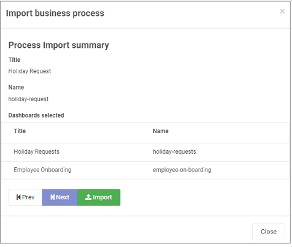

# Kianda App Store

Kianda Apps provide an instantaneous way of digitising your business processes, where you can implement logical and intelligent workflows at the click of a button. The App Store houses these Apps or **end-to-end processes** for a business function, and comes complete with dashboards to help you gain a deeper insight into the your organisation's wellbeing.

The Kianda App Store contains 26 beautifully designed apps covering 8 different business areas. Apps for each area are listed as follows:

- **General Apps** - IT Support Helpdesk, Employee Onboarding, Purchase Order Approval, Customer Support Queries, Travel Request, Procurement - Request for Proposal, Holiday Request Form, Procurement, Employee Appraisal Process, Appraisal Review Form.
- **HR**  - Employee Onboarding, Travel Request, Holiday Request Form, Employee Appraisal Process, Appraisal Review Form
- **IT**  - Cyber Security Incident Response, IT Support Helpdesk, Change Request Process
- **Customer Service**  - Customer Support Queries
- **Finance**  -  Purchase Order Approval, Per Diem Form, Invoice Generator, Expense Report, Procurement - Request for Proposal, Procurement,
- **Travel**  - Staff Ticket Request, Per Diem Form, Travel Request.
- **Quality**  - Corrective and Preventive Action Plan, Inspection Checklist, Maintenance Checklist, Incident Report
- **Accounting**  - Purchase Order Approval, Invoice Generator

All of the Apps are available for free, and you can use them as a template to design your own business processes, modifying what you see as you go. 

If you would like to try out an App, go to [How to get started](#how-to-get-started) to find out more. If you would like to build your own process from scratch go to [Plan your process](processplan.md), the first step in process creation in Kianda.

## How to get started ##

1. Go to the side menu and click on **Administration** > **App Store**.

   

2. Choose from **General**, **IT**, **Customer Services**, **Finance**, **Travel**, **Quality** and **Accounting** apps by clicking on the relevant button in the left-hand pane and then select an app from within that category, for example **Customer Support Queries**.

   

3. You can click on **Read More** to read about the app and click on **Import Process App** to import the process. 

    

4. If the process is an existing process you can choose to override the existing process by clicking **Yes** or if not click **No**. Change the Title and Name of the process as needed and click on **Next**.

    

5. The system will report datasources being imported. Click on **Next**. 

   

6. Select dashboards to be included by checking the checkbox beside dashboards you want to import. In each case you can decide to override the existing dashboards by clicking on **Yes** or if not **No**. Click on **Next**.

   

7. You will see a summary of what is about to be imported. Click on **Import** to execute the import.

   

8. The imported process is available to view and edit from the main process view.

   

   You can check out the process design, by clicking on the process itself, see [What to do next](#what-to-do-next).

9. At any time you can edit the process properties like process name and who has access to it, by clicking on the **Pen** button  and you can delete the process by clicking on the **Bin/Trash** button . You can also add more Apps by clicking on the **App Store** button .

   

   ## What to do next ##

   Remember there are 3 steps to producing business processes in Kianda:

   > 1. **Design** your process
   > 2. **Create** your process
   > 3. **Test** your process

   By importing an app, you've already done all 3 steps! However you might like to check out the design, edit a predefined process, and test the workflow. Click on the links above to go to the relevant sections.

   If you are inspired by these processes to **create your own process from scratch** go to [Design your process workflow](processdesign.md) to get started.

   In the next screen, you will see the forms within the process, in this example there are two forms: Customer Query and Agent Review. If you click on the form itself you can edit

### Design a process workflow ###

When you click on a process from the Process design view 

### Create a process workflow

### Test your workflow ###

