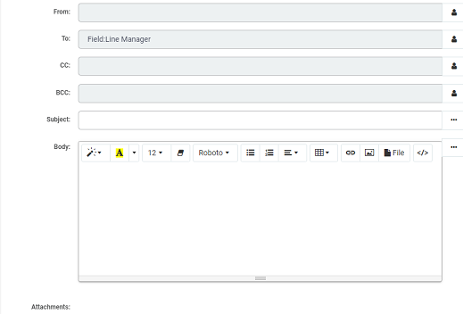

# Kianda App Store

Kianda Apps provide an instantaneous way of digitising your business processes, where you can implement logical and intelligent workflows at the click of a button. The App Store houses these Apps or **end-to-end processes** for a business function, and comes complete with dashboards to help you gain a deeper insight into the your organisation's wellbeing.

The Kianda App Store contains 26 beautifully designed apps covering 8 different business areas. Apps for each area are listed as follows:

- **General Apps** - IT Support Helpdesk, Employee Onboarding, Purchase Order Approval, Customer Support Queries, Travel Request, Procurement - Request for Proposal, Holiday Request Form, Procurement, Employee Appraisal Process, Appraisal Review Form.
- **HR**  - Employee Onboarding, Travel Request, Holiday Request Form, Employee Appraisal Process, Appraisal Review Form
- **IT**  - Cyber Security Incident Response, IT Support Helpdesk, Change Request Process
- **Customer Service**  - Customer Support Queries
- **Finance**  -  Purchase Order Approval, Per Diem Form, Invoice Generator, Expense Report, Procurement - Request for Proposal, Procurement,
- **Travel**  - Staff Ticket Request, Per Diem Form, Travel Request.
- **Quality**  - Corrective and Preventive Action Plan, Inspection Checklist, Maintenance Checklist, Incident Report
- **Accounting**  - Purchase Order Approval, Invoice Generator

All of the Apps are available for free, and you can use them as a template to design your own business processes, modifying what you see as you go. 

If you would like to try out an App, go to [How to get started](#how-to-get-started) to find out how to import apps. If you would like to build your own process from scratch go to [Plan your process](processplan.md), the first step in building a Kianda solution.

## How to get started ##

1. Go to the side menu and click on **Administration** > **App Store**.

   

2. Choose from **General**, **IT**, **Customer Services**, **Finance**, **Travel**, **Quality** and **Accounting** apps by clicking on the relevant button in the left-hand pane and then select an app from within that category, for example **Customer Support Queries**.

   

3. You can click on **Read More** to read about the app and click on **Import Process App** to import the process. 

    

4. If the process is an existing process you can choose to override the existing process by clicking **Yes** or if not click **No**. Change the Title and Name of the process as needed and click on **Next**.

    

5. The system will report datasources being imported. Click on **Next**. 

   

6. Select dashboards to be included by checking the checkbox beside dashboards you want to import. In each case you can decide to override the existing dashboards by clicking on **Yes** or if not **No**. Click on **Next**.

   

7. You will see a summary of what is about to be imported. Click on **Import** to execute the import.

   

8. The imported process is available to view and edit from the main process view.

   

   You can check out the process design, by clicking on the process itself, see [What to do next](#what-to-do-next).

9. At any time you can edit the process properties like process name and who has access to it, by clicking on the **Pen** button  and you can delete the process by clicking on the **Bin/Trash** button . You can also add more Apps by clicking on the **App Store** button .

   

   ## What to do next ##

   There are 3 steps to producing business processes in Kianda:

   > 1. **Plan** your process
   > 2. **Design** and build your process
   > 3. **Publish** your process

   By importing an app, you've already done all 3 steps! However you might like to [check out the design](#app-process-design), preview the workflow and look at the results in a dashboard. When you are happy with the process then click on [Publish](#publishing-a-process).

   

   ### Process design introduction ###
   
   By clicking on the process from the main process view, you are brought into the **process design** page.
   
   
   
   1. In the example above, there are two **forms** in this process: **Customer Query** and **Agent Review**. Clicking on the first form, Customer Query, allows you to view and edit the form and see all the fields within the form in the **form canvas**.
   
   2. Clicking on a field in the form, allows you to a) edit a field by clicking on the **Pen** button  as well as b) viewing the **field** **properties** as seen in the right-hand pane. 
   
      - For example the Date field is selected below. 
   
      
   
      - What we can see from the properties in the example above is that this field is **Visible** but not **Enabled** meaning a user can't change the value of this field when the form is presented to them. 
   
   3. There is also a **rule** attached to the date field in this example. Click on **Rules** in the right-hand pane to see the rule. Click on the rule to see what actions are applied and to edit the rule. 
   
      
   
      In this example,  the current time will be added to the date field when the user views the form, so the user doesn't have to fill out those details.
   
   4. To test out a form design, click on the **Preview** button in the left-hand pane.
   
      
   
   5. You can choose from **desktop**, **tablet** or **mobile** **preview** mode by selecting one of the buttons in the top right-hand corner, and then fill out the form with some test information. 
   
      
   
      - Under Assignee Panel, remove the Demo User by clicking on this field.
   
      
   
      - Then click on the field again to see a dropdown list of administrators for this form, and choose yourself. This is so that you can get a test email sent to your account to see the process flow. 
   
      - Click on **Submit** when done.
   
      - You should then receive an email with a link to go to approve the request. 
   
        
   
      - Click on the link and fill out the resolution with test information. Click on **Resolved**. 
   
   6. Once you have submitted some data, you can look at the dashboard for this app by going to the **side menu** > **Home** > **Customer Queries**, the dashboard for this process. This gives you an idea of the kind of information that can be captured and presented.
   
      
   
   
   
   
   
   ### Publishing a process ###
   
   If you are happy with this process and want to implement it in your instance, then return to **Administration** > **Designer** > **Customer Queries**.
   
   1. Save the process to incorporate any changes you have made by clicking on the **Save** button  in the left-hand pane.
   
   2. Click on the **Publish** button  to publish the process for use.
   
      
   
   If you are inspired to create your own process from scratch go to [Plan your process](processplan.md) or go to [Design and build your process](processdesign.md) if you already have a process planned out.
   
   
   

