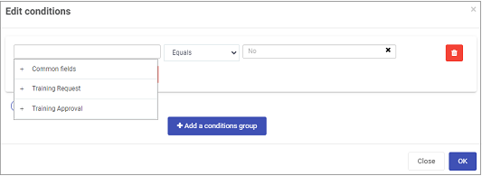

# Conditions #

Conditions allow you to make forms and dashboards fully dynamic. They are easy to configure in the Kianda platform, using natural language to create triggers for rule execution.

Conditions can be applied to [Tile](pages/tile.md), [List](pages/list.md) and [Chart](pages/chart.md) dashboard widgets.

## How to get started ##

1. Make sure you in **Edit mode** on your dashboard page by clicking on the **Edit** button  in the top menu. Click hen click on the **Pen** button.

    

2. Click on the **Update configuration** or **Pen** button for any Tile, List or Chart widget.

3. Click on the **Conditions** button appears in the dialog box.

4. Click on **Add a conditions group**  button to add a condition.

5. The **Edit conditions** dialog box opens. 

   

   Click into the first empty field to choose a field to filter on, this can be a **Common field** or a **Design field** as found in a form. Click on the + symbol to drill down to the relevant fields to use. Click on a field to use, for example the Common field, 'Status'. If you want to replace the field for a different one, click on the X  beside the field name.

6. Click on the operator field and choose from a relevant operator to apply, for example **Equals**, **Contains**, **Is blank**, **Matches pattern** and so on.

   

   If a time-based field is chosen then a drop-down list of time-related operators become available, for example **Is Today**, **Is Between Days**, **Is Before Today** and so on.

7. Depending on the operator chosen, then a value field may be visible where you can either a) type in a value that you want to hone in on, or b) click into the field to drill down to a design field as found in a form. In the example below, we are looking for a particular value called 'completed' against the Common field, 'Status'.

   

8. Click on **Add condition** to add further conditions and group together into an expression using the **drop-down list** of Boolean operators a) And or b) Or 

   

   Then add further condition groups using the **Add a conditions group**  button to add and apply the **radio buttons** of Boolean operators a) And or b) Or to tie groups together.

9. Delete conditions by clicking on the Bin/Trash button .

10. Click on the **OK** button to save your changes or click on **Close** to exit the dialog box without saving.

11. Click on **OK** button again for the **Edit widget** dialog box to apply the changes or click on **Close** to exit the dialog box without saving.

    - sdfsd
    - to create an expression

    