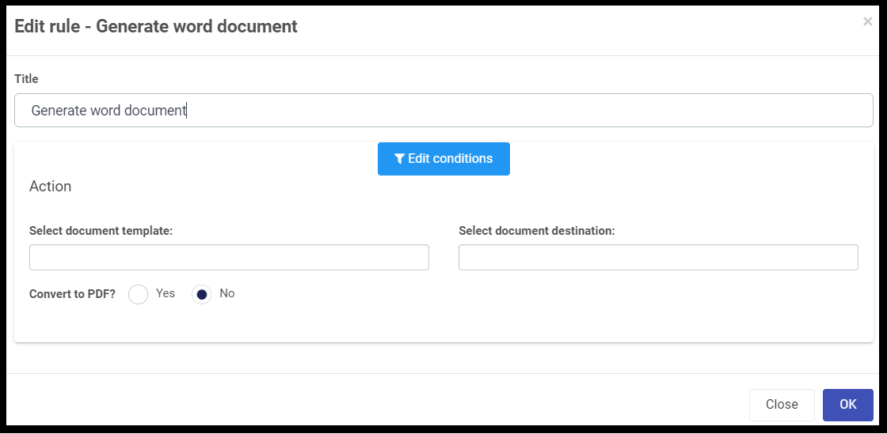

##### Generate word document 	 
###### Introduction
This rule generates a word document from data stored in the process using a template.  

###### When to use 
You can add this rule:
- [x] to a field
- [x] to a form 
- [x] to a process (the rule will run on load)

###### How to use
To generate a word document from data stored in a process:
1. Before adding the rule, add two file fields: Click on Controls > Input > File and drag the field onto the form. Edit the field by clicking on it and then clicking the pen icon. Change the Title to . 
2. Select the Submit button.
3. Add a rule > Data > Set form field.
4. Under Form field to set, select the new field called Status.
5. Under Value or expression, enter the status e.g. Complete.
6. Click on OK.

###### Notes
None.

???file name in email will appear as name of template

Document generation based on a DOCX template with form mappings		
FROM HELP???
Note: Kianda task-pane is required for mapping the field values to the word document.

Generating word document using Kianda is just a matter of few simple steps. For example, lets generate a word document on submission with fields like first name, last name, DOB, email, address, city and country. To do so:

Go to Microsoft Word.
Have the template ready with the above fields (as shown in the video).
Click on the Kianda Task-pane on the right top corner (Home page).
Now, login to Kianda using your User name and Password.
Click on two-sided arrows ⇄  and select a process from the drop-down.
Now place the cursor next to the field on the word document, select the appropriate field on the Kianda Task-pane and click on 'Insert' (repeat this for all the fields).
Save the document and go back to Kianda. Navigate to Designer > and select appropriate process.
Add two file fields on the form. First file field should store the above saved template (this template should not be deleted and this field should be connected to data source).
Select the 'Submit' button and navigate to File management > Generate word document.
You can optionally add conditions.
Now, Select document template as the first file field with template stored in it and Select document destination as the second file field.
You can chose to convert to PDF and click on 'OK'

