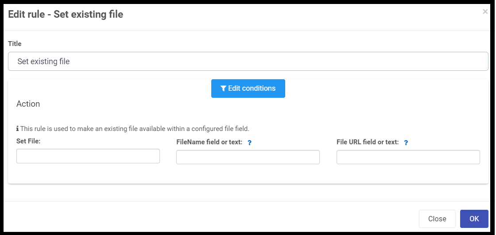

##### Set existing file
This rule .  ??Set existing file into a file field	Enables to construct the file field reference based on profiled file URL 

###### When to use 
You can add this rule:
- [x] to a field
- [x] to a form 
- [x] to a process (the rule will run on load)

###### How to use
To ???:
1. Before adding the rule, add two file fields: Click on Controls > Input > File and drag the field onto the form. Edit the field by clicking on it and then clicking the pen icon. Change the Title to . 
2. Select the Submit button.
3. Add a rule > Data > Set form field.
4. Under Form field to set, select the new field called Status.
5. Under Value or expression, enter the status e.g. Complete.
6. Click on OK.

###### Notes
None.
