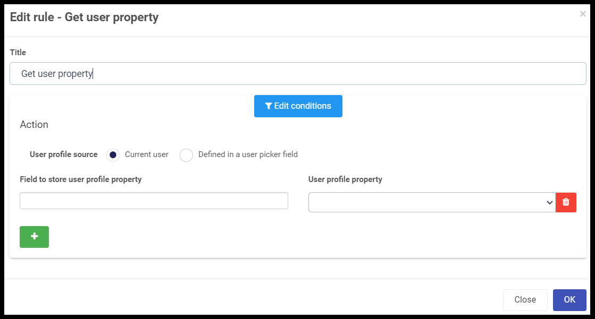

##### Get user property
###### Introduction
This rule is used to get data from the selected user profile.  A user profile contains properties such as first name, last name, department etc..  	

###### When to use 
You can add this rule:
- [x] to a field
- [x] to a form 
- [x] to a process (the rule will run on load)

###### How to use
To get a user property (e.g. department) for a given user:
1. Before adding the rule, add a text field: Click on Controls > Input > Text and drag the field onto the form. Edit the field by clicking on it and then clicking the pen icon. Change the Title to User Property. 
2. Select the 'Submit' button.
3. Administration > Add a rule > Get user property.
4. Under Action, select Current user.
5. For Field to store user profile property, choose the new User Property field.
6. From the drop down list, choose a user property e.g. department.
7. Click OK.

###### Notes
Administrators can view the profile properties for any user by selecting Administration > Users and clicking on the user's name.

