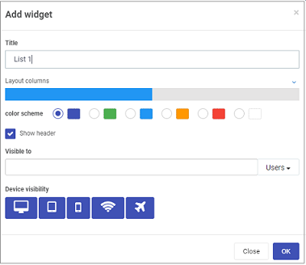
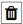
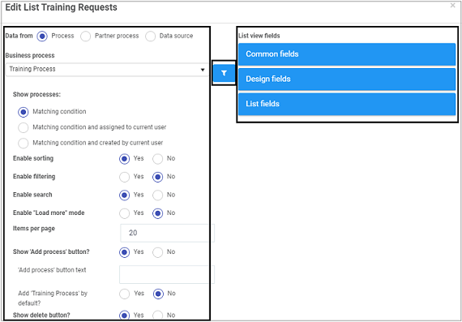

# List widget

The list widget displays the instances of the selected process in a dashboard. The List widget can also be used to connect with any other dashboard widgets to display filtered items.

## How to get started ##

1. After creating a dashboard page, make sure you are in Edit mode, by clicking on the **Edit** button  at the top of the page, so the Widget menu with 7 widget types is available. Then click on the List widget .

2. The **Add widget** dialog box opens.

   

   Choose from the edit options:

   - **Title** - the dashboard title, for example Training Requests

   - **Layout columns** - control the size of the dashboard, choose from 1 to 12 columns in width. For example click half-way across the blue bar to create a panel that is 6 columns wide, or click on the right of the blue bar to create a column that is 12 columns wide.

   - **Colour scheme** - choose from Navy, Green, Blue, Amber, Red or White Colours for your dashboard.

   - **Show header** checkbox - tick this checkbox if you wish to show a header on your dashboard.

   - **Visible to** - determine who will see the dashboard, choose from a) Users b) Groups 

   - **Device visibility** - choose from icons for deshtop, tablet, mobile, wifi and flightmode as to when the device can view the dashboards.

     

3. Click on the **OK** button when you are finished editing the dashboard to save your changes or click on **Close** to exit the dialog box without saving.

4. You can then edit the widget to display certain fields from your form, that relates to the data you are interested in. Go to [Configure your widget](#configure-your-widget) to find out more.

5. When you are finished making edits, click on the **Save** button  in the top menu to ensure your dashboard changes are saved and you see a pop-up message **Page saved successfully**.

6. To make further changes later on, click on the **Edit** button  in the top menu and then click on the **Pen** button.

    

7. To re-edit the title, colour scheme or other options in Step 2, click on the **Settings** button and the **Edit widget** dialog box options, allowing you to make changes.

7. To delete the widget at any stage, click on the **Bin** icon  beside the cog button, and then click on **Ok** to confirm that you want to delete the dashboard page or click on **Cancel** if you wish to cancel the deletion.

   

## Configure your widget ##

1. Click on the **Update configuration** or **Pen** button in a list widget you have created.

   

2. A dialog box opens with filter options in the left-hand pane, a **Conditions** button in the middle of the box, and list view fields in the right-hand pane. Go to [Conditions](pages/conditions.md) to read more about conditions you can apply to data and go to [List view fields](pages/listviewfields.md) to read more about how to apply fields to your list view.

   

3. The first option to choose is where the data should originate from using the **Data from** radio buttons. Choose from a) Process b) Partner process c) Data source. Depending on which option you choose go to the relevant area to read more on [Choosing data from a Process](#choosing-data-from-a-process), [Choosing data from a Partner process](#choosing-data-from-a-partner-process) and [Choosing data from a Data source](#choosing-data-from-a-data-source).

4. Once a data source is chosen, then there are a number of other options available, see [Filter options](#filter-options).

4. When you are finished choosing options, click on the **OK** button to save your changes or click on **Close** to exit the dialog box without saving.

   

### Choosing data from a Process ###

If you choose data from a Process, then the options below become available.

Choose from the following options:

- **Business process** - click into the field to choose a process which will be the input for the dashboard.
- **Show processes** - choose from a) Matching condition b) Matching condition and assigned to current user c) Matching condition and created by current user - TO COME BACK TO
- For all other available options see [Filter options](#filter-options).

### Choosing data from a Partner Process ###

If you choose data from a Partner Process, then the options below become available.

Choose from the following options:

- **Partner** - click into the field to choose from a pre-configured Partner who has created the process you are interested in.
- **Business process** - click into the field to choose a process which will be the input for the dashboard.
- **Show processes** - choose from a) Matching condition b) Matching condition and assigned to current user c) Matching condition and created by current user - TO COME BACK TO
- For all other available options see [Filter options](#filter-options).

### Choosing data from a Data source ###

If you choose data from a Data source, then the options below become available.

1. Click on **Select data source**. You will be directed to different data sources where you can search in the **datasource tree** search box or drill down to the data source you want. 

   

   Click on the **OK** button when you are finished editing to save your changes or click on **Close** to exit the dialog box without saving.

1. Click on **Data source filter** TO COME BACK TO.

1. For all other available options see [Filter options](#filter-options).

   

### Filter options ###

Once you have chosen where the dashboard data will come from then there are a number of other options available.

1. Choose from the edit options:

   - **Enable sorting** - choose from a) Yes or b) No if you wish to enable sorting in the dashboard

   - **Enable filtering** - choose from a) Yes or b) No if you wish to enable filtering in the dashboard

   - **Enable search** - choose from a) Yes or b) No if you wish to enable a search in the dashboard

   - **Enable "Load more" mode** - choose from a) Yes or b) No if you wish to enable more data records to be visible. If you click on **Yes**, then you can decide on what text should appear on screen, by typing the text in the **Load more button text** field.

     Enter a number in **Items per page** for the number items you wish to load at a time. The default value is '20'.

   - **Show 'Add process' button** - choose from a) Yes or b) No if you wish to Add process to your dashboard. TO COME BACK TO If you click on **Yes**, then you can decide on what text should appear on screen, by typing the text in the **'Add process' button text** field. 

     By default, the process used to generate the data is added, click on **No** beside the Add 'Process 	Name' by default if you don't wish to add the input process.

   - **Show delete button** - choose from a) Yes or b) No if you wish to add a Delete button to your dashboard. If you choose **Yes**, then the option **Enable bulk delete** appears allowing you to choose a) Yes or b) No to enable bulk deletion of records.

   - **Enable show history** - choose from a) Yes or b) No if you wish to show the history of the dashboard.

   - **Enable data export** - choose from a) Yes or b) No if you wish to allow data export.

   - Sort by - click into the Sort By field and choose from options a) Common fields or b) fields within a form.

   - **Common fields** are fields commonly used in dashboards such as 'Created' or 'Status' or choose from a field within a form by clicking and drilling down to the field name that you want to sort by, for example a text box field called 'Name' in a form called 'Training Request'.

   - When a field is chosen then the options for **Sort Direction** appear as either a) Ascending or b) 	Descending.

   - **Then by** - TO COME BACK TO

   - **Enable empty list template** - click on a) Yes or b) No to enable TO COME BACK TO.

2. Go to [List view fields](pages/listviewfields.md) to read about options in the right-hand pane of this dialog box on how to choose fields to filter data.

3. Click on the **OK** button when you are finished editing to save your changes or click on **Close** to exit the dialog box without saving.
