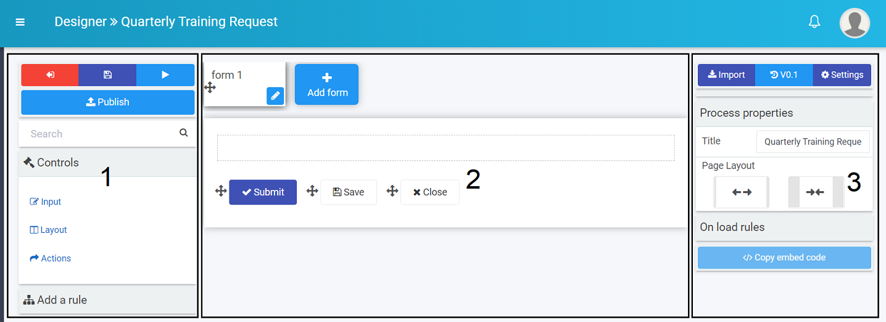
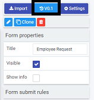

# Designer # 

Kianda **Designer** provides an intuitive interface where you can quickly start building **forms** for any business use case. Forms are an important component of any process. They might be used as a stage of a process and can be made active individually or at the same time (parallel forms).

There are 3 key principles to consider when working with forms:

1) Form design - what a form looks like, what elements it contains, for example controls and rules
2) Form management - who can edit and access forms
3) Form interaction - how users can use forms depending on certain sequences happening

This page presents the information you need related to form design, that is what a form looks like, and what it contains. By default, form designers can edit forms, but they can also set how other people interact with forms, for example to make forms viewable as **read-only**. Go to [Form management](platform/form_management.md) to find out more about how form ownership works, and [Form interaction](platform/form_interaction.md) to find out how a complete process flow works once forms are designed and assigned. Read the steps below to find out more about Form design.

## Designer layout ##

To access processes, go to the left-hand pane and **Administration** > **Designer** and click on a process that you have created or imported, see [Getting started with Kianda processes](platform/process.md).

From the main process view, click on any process to add forms.

The designer window opens and is made up of 3 main parts.

The key components of the designer are:

1. Left-hand pane contains both **controls** and **rules** that can be added to forms. Go to [Controls](fields/README.md) and [Rules](rules/README.md) to find out more. The left-hand pane also houses the **Exit** button  to go back to the process list, the **Save** button  to save your work, the **Preview** button  to preview what you have created and the **Publish** button  to publish your work. 

   Note that clicking on **Save** saves a **draft** which is not available to users until you click on **Publish**.

2. The central area is where the current **form canvas** is displayed. The canvas also houses 3 buttons by default: **Submit**, **Save** and **Close**. Go to [Adding form elements](#adding-form-elements) to find out more about editing these buttons and adding elements to the canvas.

3. The right-hand pane is where the **properties** and **rules** are displayed for the selected item, see [Properties](platform/properties.md) for more information. From this pane you can also [Import forms](#import-forms), see the [Version history](platform/version_history.md) for a process and set process [Settings](platform/settings.md). Click on the links to find out more.

Note the name of the process you are working on is shown in the top menu bar, for example Quarterly Training Request. 

## Getting started with forms

1. How you get started with forms depends on:

   - if you have created a process using the App Store, see [Predefined forms](#predefined-forms)

   - if you have created a process from scratch or want to create a form from scratch, see [New forms](#new-forms)

   - if you import forms that have already been created, see [Import forms](#import-forms)

2. Once your form is created, you are ready to start adding elements to your form, see [Adding form elements](#adding-form-elements). 

2. In addition there are a number of settings you can change, see [Settings and Properties](#settings-and-properties). 

   

### Predefined forms ###

1. If you have created a process using the App Store, then a number of forms will already be part of the process. For example the process Security Incident Management has 5 forms attached: Incident detail, Data breach, Malware outbreak, Root cause remedy and Caller review. Click on [Kianda Apps](platform/appstore.md) to find out more about other apps in the App Store. 

2. To edit form details, simply click on a form and click on the **Pen** button  to edit the form. You can also click on the **Add form** button to add a new form. Edit options are shown under [New forms](#new-forms).

   

### New forms ###

***How to add new form*** - Button has changed (layout of add form and Import) TO COME BACK TO - needs a new video

<video width="100%" style="width:100%" controls>
    <source src="../videos/How to add new form 2.mp4">
    Your browser does not support the video tag.
    </source>
</video>

1. If you have created a process from scratch, an empty form is added to your process by default, called "form 1". This is the first form. Click on this form and the **Pen** button  to customise it. You can also click on the **Add form** button  to add a new form. 

   

2. There are a number of edit options below.

   

   Note: as you change any of the options in the dialog box, the impact will be shown in real-time on the form in the background, for example a title, or colour form theme.

   1. **Title** - the form title, for example Employee Request Form

   2. **Name** - this is a unique name for the form

   3. **Default owner(s)** - by default the form creator is an owner. You can remove this owner by clicking on  and add other owners by clicking on the arrow and choose from **Users**, **Groups** or **Partners**. 

      - Users - allows you to choose individual owners
      - Groups - allows you to choose from defined groups for example HR Team or Management Team
      - Partners - allows you to choose predefined partner organisations that you want to share with or provide permissions

   4. **Activate with** - will decide when the form will be active. If you have several forms attached to a process, then select from a dropdown list the form you want to activate with the current form. If you leave the field blank, the new form will be activated **sequentially** after the first form is submitted. 

   5. **Submit mode** - options are a) Only this form (the current form) or b) All forms in edit mode

   6. **Form icon** - click on the arrow to choose from hundreds of icons to attach to your form.

   7. **Form theme** - choose from Navy, Green, Blue, Amber, Red or White Colours for your form.

   8. **Enable quick actions** - if you tick the checkbox, you can select from the options a) Enable re-assign b) Enable edit and c) Enable custom action. Click on **Ellipsis** button  to further modify the action settings. 

      - If you click on **Enable re-assign**, you can reassign action settings to particular Users, Groups or Partners. Click on **Allow form owners** if you want form owners to be able to reassign actions.

      - If you click on **Enable edit**, you can allow certain Users, Groups or Partners to edit the form, along with form owners by clicking on **Allow form owners**. 

        Other options include a checkbox for **When editing auto hide form footer buttons** and **Trigger rules on save**.
      
        - If you check **Trigger rules on save** then click into the **Save action field** to choose from an action trigger as to when the form is saved, for example Submit, Save or Close. These can be other actions depending on what you have defined.
      
        
      
      - If you click on **Enable custom action**, you can allow certain Users, Groups or Partners to edit the form, along with form owners by clicking on **Allow form owners**. 
      
        Other options include **Action label**, **Target action field** and **Action display mode**, for example **Read-only mode**, **Edit mode** or **Both**.  

        

   As a form designer you can set up actions dependent on certain conditions, for example an Action label that targets a certain button appearing for example Close button, only when a certain display mode is chosen, for example Read-only mode. If **Edit mode** is chosen, then the button will only appear when the form is being **edited**. In this way you can create dynamic forms that suit user interactions.

3. Click on the **OK** button when you are finished editing to save your changes or click on **Close** to exit the dialog box without saving.

4. To save your changes to the form, click on the **Save** button . 

5. You are now ready to start adding [Controls](fields/README.md) and [Rules](rules/README.md) to your form. You can also implement additional settings see [Process Settings](#process-settings).

   

### Import forms ###

1. You can import a previously designed form by clicking on the **Import** button .

2. Click on the arrow to select from the drop down list to **Select a process design**. 

3. Click on a process of interest and then click on the forms to import. Forms are indicated by a + symbol and can be expanded to show elements within a form for example a panel containing different fields such as lists and text boxes. This means you can import a whole form, or just elements of a form. In this way you can very quickly reuse some or all parts of an existing form. 

   

4. Click on the **OK** button when you are finished editing to save your changes or click on **Close** to exit the dialog box without saving.

## Adding form elements ##

If you have added a new form during the form creation process, then a blank canvas with 3 default buttons are available to you: **Submit**, **Save** and **Close**. 

You can:

1) Add elements to this canvas by clicking on [Controls](fields/README.md) and [Rules](rules/README.md) in the left-hand pane. Click on each link to find out more about the 16 Control fields and 
2) Move elements by clicking on the **Drag Handle**  beside the item and dragging it to where you want to place it. 
3) Edit elements by clicking on each item and clicking on the **Pen** button  for example if you click on the **Close button** there are a number of options to choose from when editing see [Form buttons](#form-buttons).

 ## Settings and Properties ## 

In addition to the edits above, there are a number other actions and settings that you can implement to your process and forms. 

Settings are available from the right-hand pane and give you the ability to:

- View [Design version history](#design-version-history)

- Change [Process settings](#process-settings)

- Create a duplicate form by selecting a form, clicking on the **Clone** button and then click on **Ok**. A version called 'Form Name Copy' is created and available to edit on the canvas. The **Clone** button can also be used to clone form elements like controls or buttons. 

- Edit form information by selecting a form and clicking on the **Pen** button .

- Delete a form by selecting a form, clicking on the **Bin/Trash** button  and then click on **Ok** after you have reviewed the form title and you are sure this is what you want to delete. Click on **Cancel** if you wish to cancel the deletion.

- View and edit [Form properties and rules](#form-properties-and-rules)

- Edit form buttons by clicking on a button of choice and then **Change field**, see [Form buttons](#form-buttons).

  

### Process settings

You can edit process settings by clicking on the **Settings** button in the right-hand pane. 

Choose from the settings:

1. **Process id settings** - choose from a) Default or b) Custom and use a combination of [ProcessName]-[UniqueNumber]-[FieldName]

2. **Enable process security** - if you tick the checkbox, can allow certain Users, Groups or Partners to have certain privileges related to the radio button options to create, assign and view as shown below.

   

   The default setting is **Security users can create, assign to can update, everyone else can view**.

3. **On load rules execution mode** - options are a) Always b) When in edit mode or c) When open new. The default setting is **Always**. TO COME BACK TO

4. **Hide form tabs** - gives you the ability to hide form tabs, options are a) Yes or b) No 

5. **Hide left nav** - gives you the ability to hide navigation elements, options are a) Yes or b) No 

6. **Enable anonymous sharing of forms** - gives you the ability to share forms with people outside your organisation for example a feedback form or GDPR subject access request. Options are a) Yes or b) No. If you click on **Yes** there are various options that you can add:

   - **Message to display after anonymous submission** - to add a display message

   

   - **Hide form topbar** - checkbox to COME BACK TO
   - **Force log out** - options are a) Yes or b) No to force user logout once the form is submitted
   - Click on **New link** to generate a new anonymous form link to share with users and click on **Edit** to change the link. TO COME BACK TO - Existing instance anonymous form URL

7. **Enable mobile bottom navigation** - options are a) Yes or b) No TO COME BACK TO

8. **Instance delete settings** - options are a) Any user can delete b) Creator can delete c) "Current form owner" can delete d) "Security users" can delete e) "Admins only" can delete. The default setting is **Creator can delete**.

9. **Enable form assignment notification** - options are a) Yes or b) No TO COME BACK TO

10. **Prevent closing instance with unsaved data** - options are a) Yes or b) No

11. **Selected tab theme** - choose from Navy, Green, Blue, Amber, Red or White as a colour when a form is selected.

12. **Completed tab theme** - choose from Navy, Green, Blue, Amber, Red or White as a colour when a form is completed.

13. Click on the **OK** button  when you are finished editing to save your changes or click on **Close** to exit the dialog box without saving.

14. Click on the **Exit** button  to go back to the process list, the Save button to save your work, the **Preview** button to preview what you have created and the **Publish** button to publish your work.

### Form properties and rules

**Form properties** are visible in the right-hand pane and show:

1. **Title** - the form title, for example Employee Request Form

2. **Visible** - click on this checkbox if you want the form to be visible to users

3. **Show info** - click on this checkbox if you want to show information???

Go to [Rules](rules/README.md) to find out more about **Form rules**.

### Form buttons ###

By default there are 3 buttons on all forms, **Submit**, **Save** and **Close**, but you can change these to buttons in a myriad of ways to customise your users' experience see sections [Editing a button](#editing-a-button), [Copying a button](#copying--a-button), [Changing button properties](#changing-button-properties) and [Deleting a button](#deleting-a-button) below.

#### Editing a button

To edit a button:

1. Click on the button and then the **Pen** button .

2. Choose from the edit options:

   1. **Title** - the button name, for example Close

   2. **Name** - this is a unique name for the button

   3. **Help text** - information to help the form user

   4. **Color scheme** - choose from Navy, Green, Blue, Amber, Red or White Colours for your button colour

   5. **Icon** - click on the arrow in the dropdown list to select from several hundred icons 

   6. **Show in form body** - options are a) Yes or b) No

   7. **Enable button security** - options are a) Yes or b) No

3. Click on the **OK** button  when you are finished editing to save your changes or click on **Close** to exit the dialog box without saving.

3. You can change the button to a different field type by clicking on the button itself and the **Change field** button in the right-hand pane. Then choose from one of 18 field types and edit the field chosen. See [Controls](fields/README.md) for more information on field types.

   

#### Changing button properties ####

To edit button properties, click on the button itself and the properties appear in the right-hand pane.

The options within properties are:

- **Title** - the name of the button, for example Close
- **Show title** - show the title of the button
- **Enabled** - the field is enabled for users to use
- **Visible** - the button is visible to users
- **Perform validation** - TO COME BACK TO
- **Show in display mode** - TO COME BACK TO
- **Layout** - change the width of the field {TO COME BACK TO - does this work for buttons??) by clicking on the bar in the Layout box until you see the desired size, from 1 to 12 columns. Click on the arrow beside Layout to see the Mobile Layout and click on the bar to change the width for mobile use.

- **Rules** - rules for input fields. These are covered in details in [Rules](rules/README.md). 

#### Copying a button ####

To copy a button you can click on **Clone** button in the right-hand pane and choose from the options:

   - **Select destination** - click into the field and then choose from another form associated to that process or a panel within another form
   - **Move field instead** - the box to move the field instead of copying

   

Click on the **OK** button  when you are finished editing to save your changes or click on **Close** to exit the dialog box without saving.

#### Deleting a button ####

Click on the on the **Bin/Trash** button  and then click on **Ok** after you have reviewed the form title and you are sure this is what you want to delete. Click on **Cancel** if you wish to cancel the deletion.
