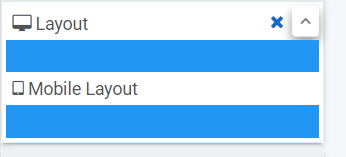

# Designer

The Designer function is found under Administration in the side menu. Kianda form **Designer** provides an intuitive interface where you can quickly start building forms for any use case.

The key components of the form designer are:

1. Left side panel containing both **controls** and **rules** that can be added to forms.
2. The central area is where the current **form canvas** is displayed.
3. The right panel is where the currently selected component **properties** and **rules** are displayed.

***Form designer key components***

## Responsive form layout

Form fields are made to with a mobile-first approach giving you design once and deploy everywhere opportunity.

By using the **Layout** option under the property panel you will be able to simply define the layout of your fields or panels within a form. Clicking on the **^** quickly uncovers the layout mode for desktop and mobile.

This allows you to specify a layout made of 1 to 12 columns and is based on bootstrap, a popular CSS  framework that allows designing web interfaces with a mobile-first approach.

## Forms & layout fields

Kianda comes with several pre-defined field widgets. In case none of these satisfies your specific needs and if you have some level of [development](development.md) skills you can always create your custom field widget.

At the time of writing, the default fields fall into four main categories of fields:

1. **Input** - Input fields include the most common data fields such as textbox, user picker, date field, table, checkbox, drop-down and number fields.
2. **Layout** - Layout fields are the fields that serve the purpose of perfecting the layout of your form. They include responsive panels, dialog box, field groups and rich text fields.
3. **Action** - Action fields are fields that allow user interface actions like buttons, links or even signature components.
4. **Custom**  - Under custom fields, you will find any custom-developed fields available under your developer section.

Layout fields take an important role when building a modern user interface and allow you to achieve the pixel perfect layout you want.

### Model dialogs

Model dialogs are a special form of layout fields. It allows a form designer to define an interface with the key intention of grabbing users attention to something important.

Typically we use dialogs for things like requiring user confirmation or to let them make a final decision.

***How to use a model dialog***

<video width="100%" style="width:100%" controls>
    <source src="../videos/How to use a model dialog.mp4">
    Your browser does not support the video tag.
    </source>
</video>

On the example above, we use a modal dialog to display a simple *warning to the user*. The following are the steps:

1. On the Layout components, select the *Dialog*.
2. Click on the dialog component to insert other fields within it.
3. You can add any field to your dialog, in this case, we are adding a Rich text.
4. To preview how your dialog box will be displayed, you can use the **Preview** button, on the dialog component.

### Forms

Forms are an important component of any process, they might be used as stages of a process and could be made active individually or at the same time (parallel forms).

The key rules for working with forms are:

1. Forms are assignable - means that only a form assignee can edit a particular form. This can be a combination of users and groups.
2. Only form owners can edit a given form by default. Any other user with access to view the form will see it in read-only mode.
3. Multi-step processes use the concept of "current form". Only the form matching the process status will be made editable.
4. In a multi-step process, other forms that are not "current form" can be configured to **activate with** the current form. Meaning they might also be editable and will form a form group.

The rules above work together to determine if the form is in edit mode or display mode. Form designers have at their disposal [business rules](business-rules.md) such as *assign form*, *go to form* and *submit rule* to dynamically control the ability for end-users to edit a particular form or a section of a form.

***How to add new form***

<video width="100%" style="width:100%" controls>
    <source src="../videos/How to add new form 2.mp4">
    Your browser does not support the video tag.
    </source>
</video>

1. Click on *Add form*, on the top right side of the page.
2. Give your form a title.
3. The *name* is a unique identifier - you can leave it as it is.
4. You can define an owner to the form.
5. Activate with will decide when the form will be active - if you leave it blank, the new form will be activated *sequentially* after the first form is submitted.
6. Select *Submit mode* - you can submit just the current form or all forms that are in edit mode.
7. Check *Enable quick actions* if you want the form to be edited or re-assigned.
8. Provide a user or group in the *Quick action user (s)* to whom you would like to permit to re-assign or edit the form.

## Anonymous Forms

Anonymous forms are a great way of allowing people outside of your organisation to interact with your processes. 

It could be something as simple as a contact form or a feedback form but as we all know a contact form never ends with the contact submission. There is always a process or a series of steps behind each public/anonymous form that might culminate with an actionable result back to the person that started the submission.

We have seen a few examples of how people use anonymous forms in Kianda. From simple feedback forms to GDPR data requests that hope between multi divisions before sending back a response to the requester with the level of information held by the organization.

Anonymous forms can be embedded in iframes and safely displayed within other web-based applications.

In Kianda there are effectively 2 types of anonymous forms

- New process anonymous form
- Existing process anonymous form

### New instance anonymous form URL

To set up a globally available link for allowing external users to create a new instance, perform the following steps within the form designer:

1. On the top right corner of the designer click on the settings button.
2. Then click the option "Enable anonymous sharing of forms" to Yes.
3. Click the button "New Link" to generate a new anonymous link.

### Existing instance anonymous form URL

To setup existing instance anonymous form one needs to use the anonymous form rule to generate a new anonymous link at the runtime that will point to an existing process record that can then be shared with external users.

Note that for this to work steps 1 and 2 of New Instance Anonymous form is still required.

The following are some of the key options of the anonymous link rule:

- Form to share (any form within an existing process).
- Link expires settings: Number of uses, time-based or never expire.
- Message to display on submission.

**Important**: There can be only one active link of each type for a given process. Once a new anonymous link is created for a process it will automatically expire the previous of the same type if a link existed.

## Input fields

Kianda forms usability is brought to life with the help of the various input fields available that are specifically adapted to work in mobile, tablet or desktop modes.

From the textbox, date picker, numeric input, file upload and table, Kianda offers a flexible array of controls that can be adjusted to work with a myriad of scenarios.

Key properties of fields:

Each field comes with its own set of settings like autofill for textbox and currency format for numeric input. 

The following are some of the common settings of input fields:

- Title - Every field comes with a title property that is usually displayed on top of the field and can serve as a prompt to a user.
- Required - This Boolean property allows making a field mandatory or not.
- Visible - Displays the field in the form or not.
- Layout - Defines both desktop or mobile layout.

### Cascading dropdown

The List field provides the opportunity to define an unlimited level cascading dropdown hierarchy very easily.

To achieve that you might connect your list to a data source table or SharePoint list then use the list data source conditions options to filter its content based on a parent list. 

***How to create cascading dropdowns***

<video width="100%" style="width:100%" controls>
    <source src="../videos/How to create cascading dropdowns.mp4">
    Your browser does not support the video tag.
    </source>
</video>

## Input validation

Validating input in forms is quick and easy. Simply enable the **required** flag of an input field and it will automatically prevent users from submitting it empty.

The required flag will conveniently be ignored in case the field is not visible, this will allow you to configure conditionally mandatory fields.

Another way of validating input is to use the **validate input rule** this allows greater flexibility in terms of when or what to validate.

## Cloning

In the form designer, almost any of the components can be cloned. This will increase your productivity considerably and will make creating multi-step processes a breeze.

To clone either a field a panel or even a form simple select the component then click the clone button in the  properties panel in the right-hand side of the panel.

If cloning a field the cloning dialog will prompt for the destination of the new cloned field, once your choice is made, simply click ok.

***Cloning a form***

<video width="100%" style="width:100%" controls>
    <source src="../videos/Cloning a form updated.mp4">
    Your browser does not support the video tag.
    </source>
</video>

## Custom fields

Custom fields section provides access to fields that are built for extensibility of Kianda capabilities. It is particularly useful in those situations where existing fields or rules will not provide the required functionality.

Custom fields have the purpose of providing a user interface for end-users. If you need to build "an action" then you should use a custom rule widget.

It allows a developer to build a reusable component that would then be used by process designers in real processes.

Check-out the [development](development.md) section for more details on how to build custom widgets in Kianda.

## Advanced techniques

Like the cascading dropdown discussed above, several other advanced scenarios can be easily configured in Kianda. Here is a short-list:

- **Repeating section** - A repeating section can be created by adding a **panel** to a table field. This table can be configured to include a single column made of the panel that itself will include the repeating fields of your repeating section.
- **The capture of media** - Kianda enables mobile users to directly capture pictures, video or audio just like a native application.
-  **Background save** - By making use of PWA principles (Progressive Web Application) Kianda allows the ability to perform background operations. This is useful when, for example, a mobile user picks-up their phone to perform a quick action and places it back in his pocket. Operations will continue in the background allowing all data to be captured.
- **Image annotation** - Kianda allows for image annotation online or offline.
- **Multi-column / row layout** - Making multi-column responsive interfaces is quite easy. Simply add two panels into a form that only use half of the screen (6 columns) then add fields inside panels and you have multiple column layouts. Adding a panel using 12 columns gives you a row.
- **Form tab colour and icon** - Form tabs can be quickly customised to display their icons or tab colours, it is also possible to define custom colours for selected and completed form tabs.
- **Hide form tab and left nav** - This is self-explanatory, yes you can hide the default navigation elements.