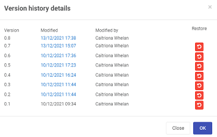

# Form Designer

Kianda **Form** **Designer** provides an intuitive interface where you can quickly start building **forms** for any use case. Forms are an important component of any process, they might be used as stages of a process and could be made active individually or at the same time (parallel forms).

The key rules for working with forms are:

1. Forms are assignable - means that only a form assignee can edit a particular form. This can be a combination of users and groups.
2. Only form owners can edit a given form by default. Any other user with access to view the form will see it in read-only mode.
3. Multi-step processes use the concept of  the "current form". Only the form matching the process status will be made editable. TO COME BACK TO
4. In a multi-step process, other forms that are not "current form" can be configured to **activate with** the current form. Meaning they might also be editable and will form a form group. TO COME BACK TO

The rules above work together to determine if the form is in **edit mode** or **display mode**. Form designers have at their disposal [business rules](business-rules.md) such as *assign form*, *go to form* and *submit rule* to dynamically control the ability for end-users to edit a particular form or a section of a form.

## Form Designer layout ##

From the main process view, double-click on any process and the form designer window opens.

The key components of the form designer are:

1. Left-hand pane contains both **controls** and **rules** that can be added to forms. Go to [Controls](fields/README.md) and [Rules](rules/README.md) to find out more. The left-hand pane also houses the Exit button  to go back to the process list, the Save button to save your work, the Preview button to preview what you have created and the **Publish** button to publish your work TO COME BACK TO
2. The central area is where the current **form canvas** is displayed. The canvas also houses 3 buttons by default **Submit**, **Save** and **Close**. Go to [Adding form elements](#Adding form elements) to find out more about editing these buttons and adding elements to the canvas.
3. The right-hand pane is where the **properties** and **rules** are displayed for the selected item, see [Settings and Properties](#Settings and properties) for more information.
4. The name of the process you are working on is shown in the top menu bar, for example Training Request. 

## Getting started with forms

1. How you get started with forms depends on:

   - if you have created a process using the App Store, see [Predefined forms](#Predefined forms)

   - if you have created a process from scratch or want to create a form from scratch, see [New forms](#New forms)

   - if you import forms that have already been created, see [Import forms](#Import forms)

2. Once your form is created, you are ready to start adding elements to your form, see [Adding form elements](#Adding form elements). 

2. In addition there are a number of settings you can change, perform, see [Settings and Properties](#Settings and Properties). 

   

### Predefined forms ###

1. If you have created a process using the App Store, then a number of forms will already be part of the process. For example the process Security Incident Management has 5 forms attached: Incident detail, Data breach, Malware outbreak, Root cause remedy and Caller review. Click on [Kianda Apps](platform/appstore.md) to find out more about other apps in the App Store. 

2. You can simply click on a form and click on the **Pen** button to edit the form details. You can also click on the **Add form** button to add a new form. Edit options are shown under [New forms](#New forms).

   

### New forms ###

***How to add new form*** - Button has changed TO COME BACK TO

<video width="100%" style="width:100%" controls>
    <source src="../videos/How to add new form 2.mp4">
    Your browser does not support the video tag.
    </source>
</video>

1. If you have created a process from scratch, an empty form is added to your process by default. Click on this form and the **Pen** button to customise it. You can also click on the **Add form** button to add a new form to any predefined processes. 

   

2. Choose from the edit options:

   1. **Title** - the form title, for example Employee Request Form

   2. **Name** - this is a unique name for the form

   3. **Default owner(s)** - by default the form creator is an owner. You can remove this user by clicking on  and add other owners by clicking on the arrow and choose from **Users**, **Groups** or **Partners**. 

      - Users - allows you to choose individual owners
      - Groups - allows you to choose from defined groups for example HR Team or Management Team
      - Partners - TO COME BACK TO

   4. **Activate with** - will decide when the form will be active. If you leave the field blank, the new form will be activated sequentially after the first form is submitted. If there are several forms attached to the process, then select from a dropdown list the form you want to activate with the current form. 

      

   5. **Submit mode** - options are a) Only this form (the current form) or b) All forms in edit mode

   6. **Form icon** - click on the arrow to choose from hundreds of icons to attach to your form.

   7. **Form theme** - choose from Navy, Green, Blue, Amber, Red or White Colours for your form.

   8. **Enable quick actions** - if you tick the box, you can select from the options a) Enable re-assign b) Enable edit and c) Enable custom action. Click on **Ellipsis** button to further modify the action settings. 

      - If you click on **Enable re-assign**, you can reassign action settings to particular Users, Groups or Partners. Click on **Allow form owners** if you want form owners to be able to reassign actions.

      

      - If you click on **Enable edit**, you can allow certain Users, Groups or Partners to edit the form, along with form owners by clicking on **Allow form owners**. 

        Other options include a tick box **When editing auto hide form footer buttons** and **Trigger rules on save**. TO COME BACK TO. Click on the Save action field bar to choose from actions: **Submit**, **Save** or **Close**. 

        

      - If you click on **Enable custom action**, you can allow certain Users, Groups or Partners to edit the form, along with form owners by clicking on **Allow form owners**. 

        Other options include **Action label**, **Target action field** and **Action display mode**, for example **Read-only mode**, **Edit mode** or **Both**.  TO COME BACK TO

     

3. Click on the **OK** button  when you are finished editing or click on **Close** to exit the dialog box.

4. To save your changes to the form, click on the **Save** button . 

5. You are now ready to start adding [Controls](fields/README.md) and [Rules](rules/README.md) to your form. You can also implement additional settings see [Process Settings](#Process Settings).

   

### Import forms ###

1. You can import a previously designed form by clicking on the **Import** button .

2. Click on the arrow to select from the drop down list to **Select a process design**. 

3. Click on a process of interest and then click on the forms and fields to import. Forms are indicated by a + symbol and can be expanded to show elements within a form like a panel containing different fields like lists and text boxes. 

   

   In this way you can very quickly reuse some or all parts of an existing form. 

4. Click on the **OK** button  when you are finished editing or click on **Close** to exit the dialog box.

## Adding form elements ##

If you have added a new form during the form creation process, then a blank canvas with 3 default buttons are available to you: **Submit**, **Save** and **Close**. 

You can:

1) Add elements to this canvas by clicking on  [Controls](fields/README.md) and [Rules](rules/README.md) in the left-hand pane.
2) Move elements by clicking on the **Drag Handle**  beside the item and dragging it to where you want to place it. 
3) Edit elements by clicking on each item and clicking on the **Pen** button  for example if you click on the **Close button** there are a number of options to choose from when editing see [Form buttons](#Form buttons).

 ## Settings and Properties ## 

In addition to the edits above, there are a number other actions and settings that you can implement to your process and forms. 

Settings are available from the right-hand pane and give you the ability to:

- View [Design version history](#Design version history)

- Change [Process settings](#Process settings)

- Create a duplicate form by selecting a form, clicking on the **Clone** button and then click on **Ok**. A version called 'Form Name Copy' is created and available to edit on the canvas. The **Clone** button can also be used to clone form elements like controls or buttons. 

- Edit form information by selecting a form and clicking on the **Pen** button .

- Delete a form by selecting a form, clicking on the **Bin/Trash** button  and then click on **Ok** after you have reviewed the form title and you are sure this is what you want to delete. Click on **Cancel** if you wish to cancel the deletion.

- View and edit [Form properties and rules](#Form properties and rules)

- Edit form buttons by clicking on a button of choice and then **Change field**, see [Form buttons](#Form buttons).

  

### Design version history ###

The **current version** of a process is always visible in the right-hand pane, for example V0.1 as shown below.

The **first version** of a process is **0.1** and will increment to 0.2 and so on, each time a process is saved. Once the process is **published** the version changes to **1.0** and increments with each publication. This makes it is easy to keep track of who and when changes were made and to restore an older version if needed. 

1. To view the version history click on the **Design version history** button  .

2. A pop-up shows the version history details including when the version was created and who created it. 

   

3. Click on a particular version to see the version information, for example forms, fields and rules that were added,  modified or removed.

4. Click on the **Restore** button  beside a particular version and then click on **Ok** to confirm that you want to restore to that version. 

### Process settings

You can edit process settings by clicking on the **Settings** button in the right-hand pane. 

Choose from the settings:

1. **Process id settings** - choose from a) Default or b) Custom and use a combination of [ProcessName]-[UniqueNumber]-[FieldName]

2. **Enable process security** - if you tick the box, can allow certain Users, Groups or Partners to have certain privileges related to the radio button options to create, assign and view as shown below.

   

   The default setting is **Security users can create, assign to can update, everyone else can view**.

3. **On load rules execution mode** - options are a) Always b) When in edit mode or c) When open new. The default setting is **Always**. TO COME BACK TO

4. **Hide form tabs** - gives you the ability to hide form tabs, options are a) Yes or b) No 

5. **Hide left nav** - gives you the ability to hide navigation elements, options are a) Yes or b) No 

6. **Enable anonymous sharing of forms** - gives you the ability to share forms with people outside your organisation for example a feedback form or GDPR subject access request. Options are a) Yes or b) No. If you click on **Yes** there are various options that you can add:

   - **Message to display after anonymous submission** - to add a display message

   

   - **Hide form topbar** - tickbox to COME BACK TO
   - **Force log out** - options are a) Yes or b) No to force user logout once the form is submitted
   - Click on **New link** to generate a new anonymous form link to share with users and click on **Edit** to change the link. TO COME BACK TO - Existing instance anonymous form URL

7. **Enable mobile bottom navigation** - options are a) Yes or b) No TO COME BACK TO

8. **Instance delete settings** - options are a) Any user can delete b) Creator can delete c) "Current form owner" can delete d) "Security users" can delete e) "Admins only" can delete. The default setting is **Creator can delete**.

9. **Enable form assignment notification** - options are a) Yes or b) No TO COME BACK TO

10. **Prevent closing instance with unsaved data** - options are a) Yes or b) No

11. **Selected tab theme** - choose from Navy, Green, Blue, Amber, Red or White as a colour when a form is selected.

12. **Completed tab theme** - choose from Navy, Green, Blue, Amber, Red or White as a colour when a form is completed.

13. Click on the **OK** button  when you are finished or click on **Close** to exit the dialog box. 

14. Click on the **Exit** button  to go back to the process list, the Save button to save your work, the **Preview** button to preview what you have created and the **Publish** button to publish your work.

### Form properties and rules

**Form properties** are visible in the right-hand pane and show:

1. **Title** - the form title, for example Employee Request Form

2. **Visible** - click on this tickbox if you want the form to be visible to users

3. **Show info** - click on this tickbox if you want to show information???

Go to  [Rules](rules/README.md) to find out more about **rules**.

### Form buttons ###

By default there are 3 buttons on all forms, **Submit**, **Save** and **Close**, but you can change these to buttons of your choice. 

#### Editing a button

To edit a button:

1. Click on the button and then the **Pen** button .

2. Choose from the edit options:

   1. **Title** - the button name, for example Close

   2. **Name** - this is a unique name for the button

   3. **Help text** - information to help the form user

   4. **Color scheme** - choose from Navy, Green, Blue, Amber, Red or White Colours for your button colour

   5. **Icon** - click on the arrow in the dropdown list to select from several hundred icons 

   6. **Show in form body** - options are a) Yes or b) No

   7. **Enable button security** - options are a) Yes or b) No

   Click on the **OK** button  when you are finished or click on **Close** to exit the dialog box. 
   
   

#### Copying a button ####

To copy a button you can click on **Clone** button in the right-hand pane and choose from the options:

   - **Select destination** - click into the field and then choose from another form associated to that process or a panel within another form
   - **Move field instead?** - tick the box to move the field instead of copying

   

   Click on the **OK** button  when you are finished or click on **Close** to exit the dialog box. 

