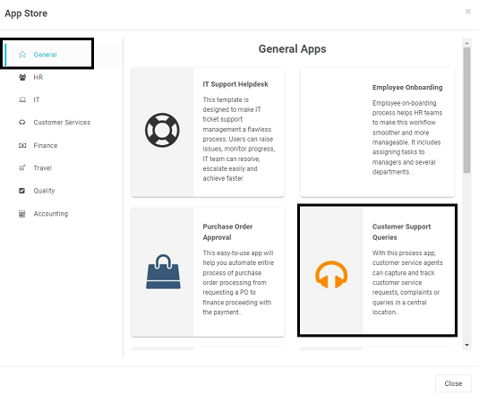
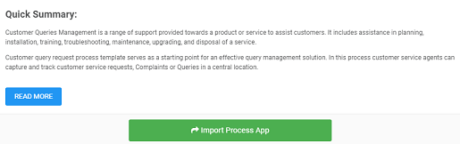
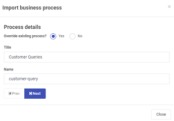
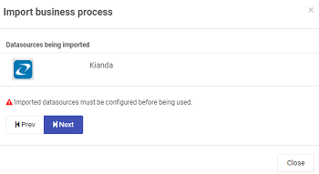
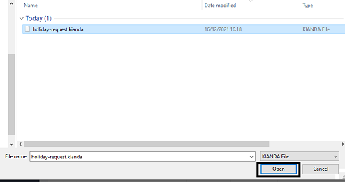
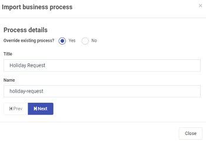
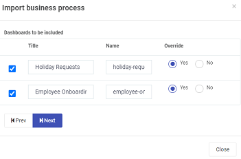
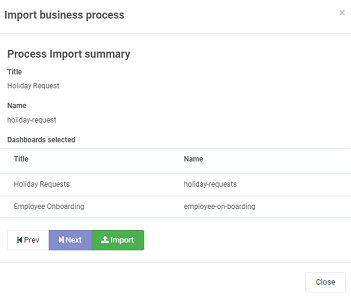

## Getting started with Kianda processes

The power of Kianda lies in giving anyone, even those without coding experience, the ability to design a **business application or process** quickly and efficiently, for example, this process could be a Quality Assurance checklist that installation engineers must follow on site using an app on their mobile phone or it could be a HR process to allow employees to submit annual leave requests and approve these online. Processes can connect to your data sources like Sharepoint or SalesForce allowing for the flexibility of your applications to grow as your business grows.

Each process comes with **dashboards** so you can see at a glance, for example, how many leave requests were submitted, approved and so on. And you can customise all of these processes the way you want.

Before you begin, we at Kianda recommend doing some simple planning before you design your process. It could be something as simple as a quick flow chart or a spreadsheet where you quickly log the key components, fields or rules that should be needed in the process. 

## Creating processes ##

1. To start creating your first process, go to the side menu on the left of the screen and click on  **Administration** > **Designer**. 

2. To create processes you can:

   - Use Kianda's pre-defined processes or Apps, see [Create processes using the App Store](#Create processes using the App Store)

   - Create your own processes from scratch, see [Create your own processes](#Create your own processes) 

   - Import processes that are already created, see [Importing processes](#Importing processes)

3. When you have created your process go to [Editing processes](#Editing processes) to find out more about your new process.

   ​    

### Using the App Store

1. You can choose from Kianda's process templates by clicking on the **App Store** button 

2. Choose from General, IT, Customer Services, Finance, Travel, Quality and Accounting apps in the left-hand pane and then select an app from within that category, for example Customer Support Queries.

   Click on [Kianda Apps](platform/appstore.md) to find out more about other apps in the App Store.

   

3. You can click on **Read More** to read about the app and click on **Import Process App** to import the process. 

    

4. If the process is an existing process you choose to override the existing process by clicking **Yes** or if not click **No**. Change the Title and Name of the process as needed and click on **Next**.

    

5. The system will report datasources being imported. Click on **Next**. 

   

6. Select dashboards to be included by checking the tickbox beside dashboards you want to import. In each case you can decide to override the existing dashboards by clicking on **Yes** or if not **No**. Click on **Next**.

   

7. You will see a summary of what is about to be imported. Click on **Import** to execute the import.

8. Imported processes are available to view and edit from the main process view.

5. When you have created your process go to [Form Designer](platform/form_designer.md) to find out more on how to add and change forms within your process(es).

### Creating your own processes

1. To create your own process, click on the **Add new button**  . Note that if you click on the arrow you have options to create a Process, a Component or to Create from datasource. Click on [Process design](platform/processdesign.md) to find out more.

   

2. Choose from the edit options:

   - **Title** - of the process, for example Annual Leave Approval

   - **ID** - this is a unique name for the field

   - **Description** - a description of the process

   - **Group** - TO RETURN TO

   - **Administrators** - choose from a) Users or b) Groups

     These are the users or groups who will act as administrators for the process, for example to edit or delete the process. For example if you click on **Users** and click in the Administrators field you will see a list of all the users who are approved to administrate this process.

     

3. Click on the **OK** button  when you are finished, or click on **Close** to exit the dialog box.

3. When you have created your process go to [Form Designer](platform/form_designer.md) to find out more on how to add forms to your process(es).

   

### Importing processes

1. If you already have Kianda processes, you can also import these by clicking on the **Import** button .

2. Click on **Browse Process App** to browse for Kianda files. 

3. Select the files you want, for example holiday-request.kianda and click on Open. 

   

4. If the process is an existing process you choose to override the existing process by clicking **Yes** or if not click **No**. Change the Title and Name of the process as needed and click on **Next**.

   

5. The system will report datasources being imported. Click on **Next**. 

   

6. Select dashboards to be included by checking the tickbox beside dashboards you want to import. In each case you can decide to override the existing dashboards by clicking on **Yes** or if not **No**. Click on **Next**.

   

7. You will see a summary of what is about to be imported. Click on **Import** to execute the import.

   

8. Imported processes are available to view and edit from the main process view.

8. When you have imported your process(es) go to [Form Designer](platform/form_designer.md) to find out more on how to edit or add forms to your process(es).

### Exporting processes

1. You can export processes by clicking on the **Export** button and select a business process to export from the dropdown list.

   

2. Click on **Next**.

3. The system will report what datasources are included. Click on **Next**.

   

4. Select dashboards to be included by checking the tickbox beside dashboards you want to export. Click on **Next**.

    

5. Click on **Export**.

6. The result is a downloadable file of type .kianda. This can be kept as a backup on a separate system and imported into other Kianda instances as needed.

   

## Editing processes

1. When processes are created they are available to view and to edit.

   

   You will note that information related to your processes are found in the main view panel, for example who created the process, and when. 

2. The first version of a process is **0.1** and will increment to 0.2 and so on, each time a process is updated. Once the process is **published** the version changes to **1.0** and increments with each publication. This makes it is easy to keep track of who and when changes were made and to restore an older version if needed. You can search for processes by typing your keywords into the search bar.

2. When you have created your process go to [Form Designer](platform/form_designer.md) to find out more on how to add and change forms within your process(es).

3. At any time you can edit the Title, Description, Group and Administrators of the process by clicking on the Pen button .

4. At any time you can delete a process by clicking on the Bin/Trash button  and then click on **Ok** after you have reviewed the process title and are sure this is what you want to delete. Click on **Cancel** if you wish to cancel the deletion.

