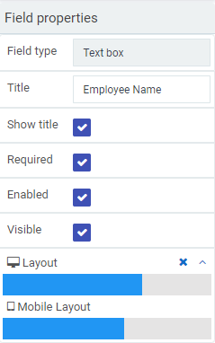

# What can you do with Kianda #

## Field properties ##

### Mobile-first approach ###

As a no-code developer, you can use Kianda's features to design forms that adopt a **mobile-first approach**, keep. It is easy for you to adopt this approach simply by clicking on a field like a text box, lists, table or button and then click on the Layout bar within properties in the right-hand pane. Choose from 1 to 12 columns. 

This layout is based on bootstrap, a popular Cascading Style Sheets (CSS) framework that supports the design of web interfaces with a mobile-first approach. 