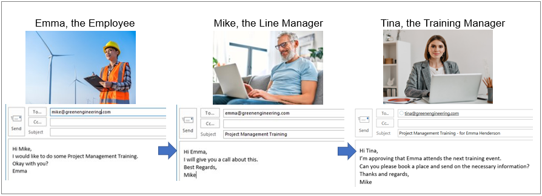
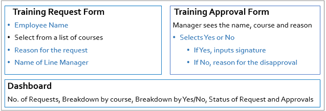

# Plan your process

Currently you may have paper forms or email flows that you want to formalise, digitise and most importantly, link to dashboards to see at a glance how processes are running and where organisational improvements are needed.

For example take the scenario of a Training Request. An employee may email a line manager requesting to attend training. The line manager either approves or disapproves the request by returning an email or calling the employee. If the training request is approved then the training manager is informed that the employee will attend the next training event and schedule this. 

Rather than continuing the above, creating an email trail with no easy way to see the overall end-to-end process and status of each step, creating a solution in Kianda will save time, increase efficiencies and therefore reduce costs.

To plan your solution you need to consider:

> 1. What **information** you need
> 2. What is the **sequence** of events 
> 3. Who will have **access** to this information

The steps above are covered in the section [How to get started](#how-to-get-started). If you already have a design for your business process, then you can go to [Design and build a process](/processdesign.md) to implement your design in Kianda. If you would like to use Kianda's predefined processes instead go to the [Kianda App Store](/kiandaapps.md) to find out more.

## How to get started ##

To plan a solution, you could use Microsoft Office Tools or other preferred program or method to chart out what you need.

1. Consider **what information you need** for your process, that is what forms, what kind of fields and other data you seek. What about information you need to provide? Using external **datasources** like information in SharePoint, Salesforce or SAP will make your processes dynamic and up to date.

   In the example of a Training Request process, information sought is in blue below, while information provided, for example a SharePoint list is in black, and everything is listed where it potentially will be displayed, that is forms and a dashboard.

   

   

   It might help to know what kind of fields there are in Kianda and to keep this in mind when capturing requirements, see Kianda Controls and Rules when you start to [Create a process](/processcreate.md).

2. Decide on the **sequence of events** for example what information will be sought at what point, what is the end point in each step. What is the trigger for the next event?

   In the Training Request process, we've now introduced **Submit** buttons to trigger actions, and a **Rule** so that the form will appear differently based on different inputs.

   

3. Finally you need to consider **who will have access** to the information. When designing forms you can enable elements within a form so that they appear as visible-only or editable. 

   

   You can also control who has editing access to the forms themselves.

Now that you know what you need and have a design in mind, you can start to [Design and build your process](/processdesign.md) in Kianda!

   

