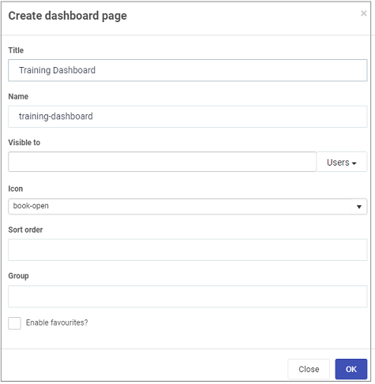
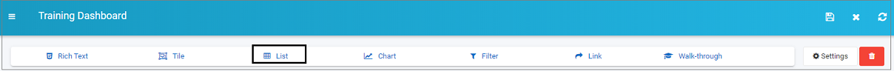
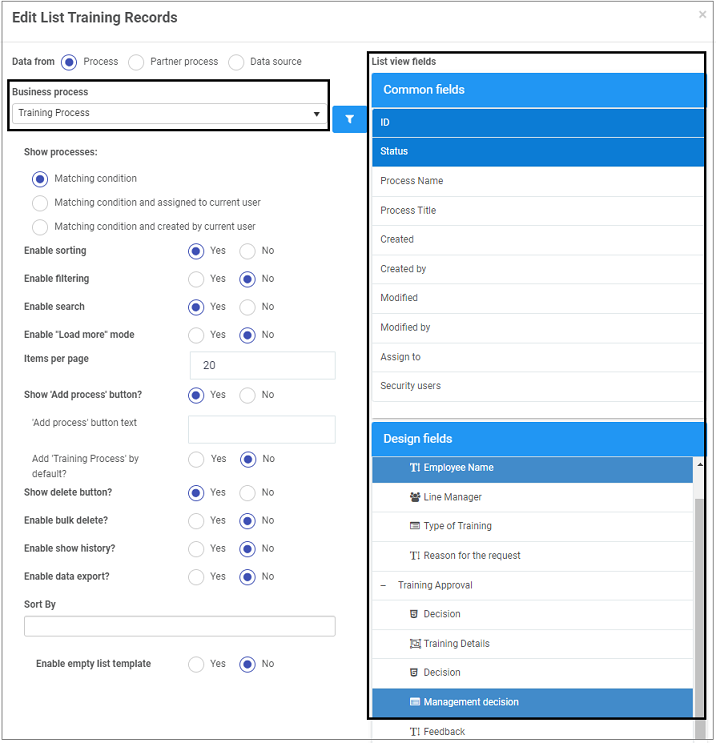
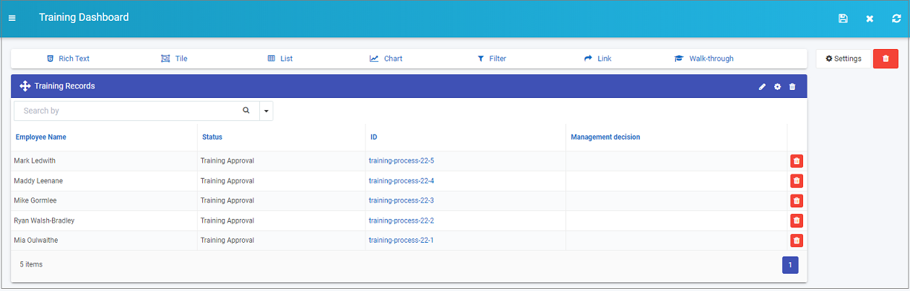
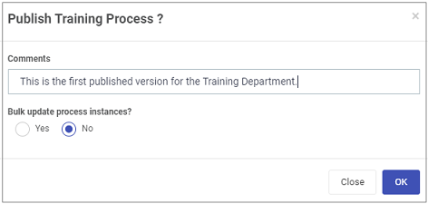

# Publish your process #

When you have designed and built your process, you are ready to publish. 

Before you publish, you can [preview your process](#preview-a-process), generating some data which you can then see in a [dashboard](#build-a-dashboard). Finally save your work and [publish](#save-and-publish).

## Preview a process ##

1. To preview a process go to **Administration** > **Designer** > **select the process** > **Preview**.

   

2. Choose from **desktop**, **tablet** or **mobile** **preview** mode by selecting one of the buttons in the top right-hand corner, and then fill out the form with some test information and click on **Submit**. 

   

   As part of this prototyping, if you choose yourself as the Line Manager, then you will receive the automated email with a link to approve the process so the workflow can be tried and tested.

3. To see the output of the data, it is useful to [build a dashboard](#build-a-dashboard).

## Build a dashboard

Using process dashboards provides real-time metrics to help guide decisions and make improvements in the organisation. 

To build a dashboard:

1. Go to the **side bar** > **Home** and then click on **Create a new page** button in the top menu bar.

2. Fill out the **Create dashboard page** dialog box. Click on **OK** when complete.

   

3. The result is a menu of 7 widgets that you can add to your dashboard page. Go to [Dashboards](pages/readme.md) to find out more. For the moment we are going to add 1 widget, a list widget. Click on **List** widget.

   

4. Fill out the **Add widget** dialog box. Click on **OK** when complete.

   

5. Configure the widget by clicking on the **Pen** icon for the widget.

   

6. There are a number of options to choose from in the **Edit List** dialog box, see [List](pages/list.md) for more details. For now we are going to concentrate on two things: a) connecting to a business process b) choosing certain fields to view in our list.

   - Click on **Business Process** in the left-hand pane and select the process you want to link to, in this case Training Process.

     

   - In the right-hand pane, click on **Common fields** and/or **Design fields** and select the fields that you want to show in your list widget. Click on **OK** when complete.

7. The result is a dashboard that shows records of Training Requests submitted, and that status of the process, or 'where they are at' in this case they all need to be approved as they have status 'Training Approval', so the dashboard in this case highlights bottlenecks in the organisation.

   

   There are endless possibilities with dashboards, the steps above are designed to highlight one particular scenario. When you are happy with your page click on the Save button  in the top menu bar.

## Save and Publish ##

When you have tested your process prototype, by previewing and adding some data and you are happy with the process output in the format of a dashboard, then you are ready to publish!

To save all your process go to the **side menu** > **Administration** > **Designer** > click on the **process name**.

1. Click on the **Save** button in the left-hand pane. Note that the **Version** of the process is available in the right-hand pane, where the current version is always visible.

   

2. Click on the **Version** button to see the Version history. Here you can rollback to an earlier version by clicking on the Restore button beside a version of choice. Note that all draft versions are 0.x. Only when a process is published will the version change to 1.x. Click on **OK** to close the dialog box.

   

3. When you are ready to Publish, click on the **Publish** button .

4. Fill out the **Publish process** dialog box by adding comments or choosing to bulk update process instances. Click on **OK** when complete.

   

   