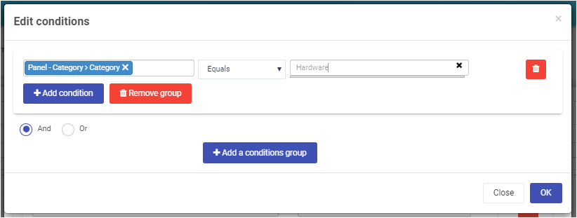

# Introduction to rules with Kianda

Business rules are what makes Kianda forms come alive. They represent the actual actions users intend to perform when they interact with form components.

> There are 56 default business rules in Kianda and you might easily create more.

In Kianda, we categorise business rules in the below categories:

- **Workflow** - Enables you to execute actions that might change the flow of the information within a process. 
- **Communications** - Enables sending emails or meeting requests or even user (push) notifications.
- **Data** - This is an important and flexible rule group because it allows you to configure CRUD (Create, Read, Update and Delete) actions to configured data sources.
- **Users** - This enables you to retrieve a user property, updating user properties or lookup for a user based on a user attribute.
- **File Management** - Allows operations such as the generation of a word document and conversion to PDF and more.
- **Tables** - Provides specialised rules to enable working with tables like sorting, copying table rows to another table and more.
- **Dates** - Enables convenient date calculation with advanced options like ignoring weekends or special dates.
- **Form actions** - Allows operations like submit, save, close and delete forms. 
- **SharePoint** - Provides a variety of operations to be performed on the SharePoint connection. These rules include operations like create a list, find a user, define permission to an item, check-in / out an item or adding a user to a SharePoint group.

## Conditions

Flexible and dynamic conditions form an important component to make forms fully dynamic. It enables you  to create natural language conditions when rules should be triggered.

## Workflow rules

Kianda workflow rules represent the actions a user intend to perform when they interact with form components. Below are the workflow rules:

1. ### Hide or disable 

   This rule is used to hide, disable, show or enable one or more fields, one or more sections or entire forms. This rule has special meaning in terms of workflow allowing the application to direct user action and flow by hidding or showing entire sections of the applilcation. [Read more about the hide or disable rule.](rules/1_workflow/hide_or_disable.md)

2. ### Go to form 

   Go to form rule navigates the user from the current form to the destination form. This rule could also set the destination form's display mode (Auto / Edit mode / Read mode). [See advanced usage details.](rules/1_workflow/go_to_form.md)

3. ### Assign form 

   This rule enables dynamic form ownership and form security assigment of a form owner by assigning a user or a group to a form. You could also choose to override or append the form owner. By default only form owners can see the form in edit mode. [Read more.](rules/1_workflow/assign_form.md)

4. ### Process security 

   This rule defines the security of the entire process instance (record). Using this rule, you could add any user or group with the right permissions to view/update any instances. [Read more.](rules/1_workflow/process_security.md)

5. ### Start a (sub) process

   Start a process rule helps you create a new instance of the same process or a different process. You could also map the inputs from the current instance to a new instance. [Read more for advanced usage details.](rules/workflow/start_process.md)

6. ### Schedule a rule 

   This rule helps you schedule a rule/rules to be triggered one time, with a recurring schedule or immediately. For example, this rule could be used to schedule a daily reminder email to a user if the task is not complete. [Read more.](rules/workflow/schedule_rule.md)

## Data rules (CRUD)

Data rules make the basis for working with data records display the actual flow of data while interacting with form components. The flow of data could be internally or externally connected to different data-connectors.

1. ### Set form field 

   Use this rule to set or unset one or more fields. The field value could be a simple text or based on a custom expression with ability to define JavaScript expressions. [Read more for advanced usage details.](rules/data/set_form_field.md)

2. ### Find items (Read data)

   This rule is used to find an item from your data-connections. To find an item, you could use a data source filter which acts as a conditional bridge between Kianda and data-connections. If the condition is true, you could map the data source field or text to the Kianda form field.

3. ### Create item (Create data)

   The create item rule is used to create an item on your data-connection. This is a straight forward rule which allows you to connect to your data source and map inputs. Also, you could map a data source field or text back to Kianda on success or store an error message on failure.

4. ### Update item (Update data)

   At any point, if you would like to update any item on your data connection, this rule does it. To find an item to update, you could use a data source filter and map the input fields or text.

5. ### Delete item (Delete data)

   This rule works exactly like Update item rule. To delete an item from your data connection, you could use a data source filter and map data source field or text from a data connection to Kianda form field.

## Custom rules

Under custom rules, you will find any custom-developed rules available under your developer section. Custom rules provide access to rules that are built for extensibility of Kianda capabilities. This is particularly used in situations when existing rules do not provide the required functionality.

Custom rules have the purpose of providing a user interface for the end-users. If you need to build "a rule" then you should use a custom rule widget.

It allows a developer to quickly build a reusable component that would then be used by process designers in real processes.

Check-out the [development](development.md) section for more details on how to build custom widgets in Kianda.

