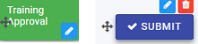

# Rules #

Business rules are what makes Kianda forms come alive. They represent the actual actions users intend to perform when they interact with form components.

There are 2 key principles to consider when working with forms:

1) Rule design - what type of rule you are going to apply and where, for example to a button, field or form
2) Rule order - if there are several rules attached to an item like a button, then the order of execution is important and can be modified to suit your needs.

## Getting started with Rules ##

If you go to **Administration** > **Designer** and click on a process or create a new process, the predefined rules are found in the left-hand pane under **Add a rule**.

 

There are 10 categories of rules:

1. **Workflow** - rules that represent the actions a user intends to perform, when they interact with form components. There are 6 workflow rules, see [Workflow](workflow.md) for more information.
2. **Communications** - rules associated with user communication for example sending an email or triggering a user alert, see [Communications](communications/README.md) for more information. 
3. Data - 
4. Users
5. File management
6. Tables
7. Dates
8. Form actions
9. SharePoint
10. KiandaAI

## When to use rules

You can rules:

- [x] to a field
- [x] to a form 
- [x] to a process (the rule will run on load)

## How to use rules ##

1. Click on an existing process by going to **Administration** > **Designer** and decide which form, or field you will apply the rule to, by clicking on that item so that it is in **edit mode** so you can see the Pen button,  **Pen** button  for example a form Training Approval or Submit button.

    

2. gfdgdg

 

1. sdfdsf

Rules can be applied to 

### Rule order ###

If there is more than 1 rule for an item like a field or button, then the order of execution must be considered. 

For example for a Submit button on a form I may want my **Send email rule** to be executed first before any other rule is executed. To do this click on the **Submit** button to make sure you are in **Edit** mode, and under **Rules** in the right-hand pane,  drag the **Send email** rule to the top of the list by clicking on the rule and dragging it to the top.

