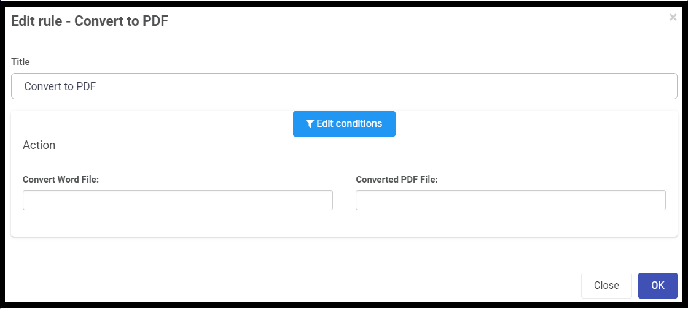

##### Convert to PDF 	 
###### Introduction
This rule converts a Word document (.doc or .docx) to PDF.	

###### When to use 
You can add this rule:
- [x] to a field
- [x] to a form 
- [x] to a process (the rule will run on load)

###### How to use
To convert a Word file to PDF:
1. Before adding the rule, add two file fields: 
- Click on Controls > Input > File and drag the field onto the form. Edit the field by clicking on it and then clicking the pen icon. Change the Title to Source File. 
- Repeat for another field called Destination File.
3. Select the Submit button.
4. Add a rule > File management > Convert to PDF.
5. ???.
6. ???.
7. Click on OK. 

###### Notes
None.